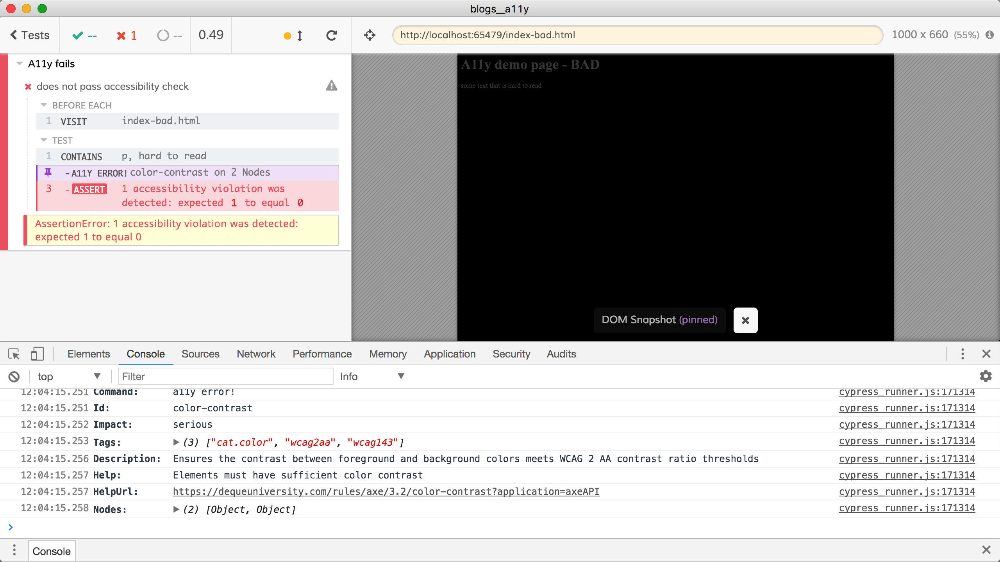

# a11y example

This demo shows the [cypress-axe](https://github.com/avanslaars/cypress-axe) plugin which can run the [Axe-core](https://github.com/dequelabs/axe-core) library against the webpage to check if the page follows accessibility practices.

The tests are in [cypress/integration](cypress/integration) folder.

- The [passing-spec.js](cypress/integration/passing-spec.js) loads local [index.html](index.html) with high contrast text, which passes A11y checks
- The [failing-spec.js](cypress/integration/failing-spec.js) loads local [index-bad.html](index-bad.html) with low contrast text, failing the checks

**Note:** the actual failures are printed in the DevTools console

## Additional resources

- Watch this [live pair programming session](https://youtu.be/IADSsClWVtA) that shows a Gatsby.js site being tested using `cypress-axe`
