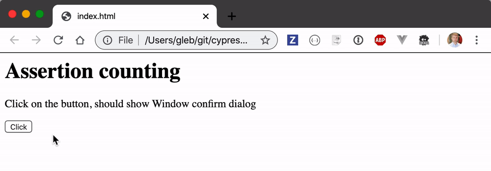
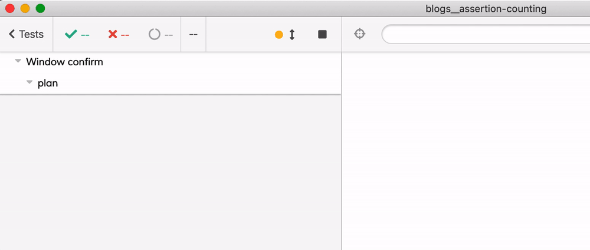
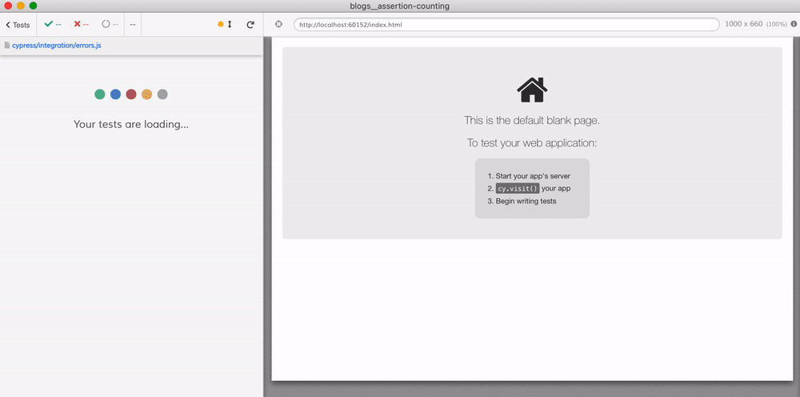

# Assertion counting

Read the blog post [When can the test stop?](https://www.cypress.io/blog/2020/01/16/when-can-the-test-stop/)

See the application in [index.html](index.html) that shows `window.confirm` on click



The [cypress/integration/spec.js](cypress/integration/spec.js) shows various ways the tests can ensure the async assertions finish before the test finishes. The last test shows how to use [cypress-expect-n-assertions](https://github.com/bahmutov/cypress-expect-n-assertions) to automatically wait for declared number of assertions to run before finishing the test.

```js
import { plan } from 'cypress-expect-n-assertions'
it('waits for planned number of assertion to run', () => {
  plan(1)
  cy.visit('index.html')

  cy.on('window:confirm', (message) => {
    expect(message).to.equal('Are you sure?')
  })

  cy.get('#click').click()
})
```



## Unhandled promise rejections

If the application code creates an unhandled rejected promise, Cypress does NOT see it by default. If you want to fail the test, listen to the unhandled promise event and throw an error. See spec file [errors.js](cypress/integration/errors.js)


