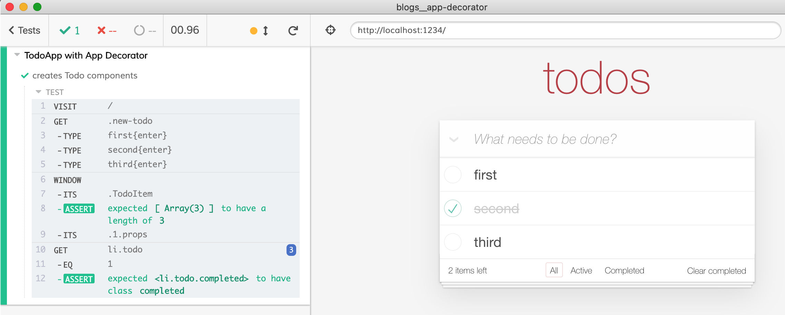

# JavaScript class decorator
> Using class decorator to automatically attach instance to the window

The application source code uses a [class decorator](https://www.sitepoint.com/javascript-decorators-what-they-are/) to automatically save any created instances on the `window` object when running inside Cypress.

```js
// src/components/TodoList.jsx
import { CypressInstances } from '../decorators'

@CypressInstances()
export default class TodoItem extends Component {
  ...
}
```

During the test, we can get to that component using `cy.window().its('TodoItem')` to check internal state or trigger component's methods.

```js
// cypress/integration/spec.js
it('creates Todo components', () => {
  cy.visit('/')
  cy.get('.new-todo')
    .type('first{enter}').type('second{enter}').type('third{enter}')

  cy.window().its('TodoItem').should('have.length', 3)
    // let's complete second todo
    .its('1.props').then((props) => {
      props.completeTodo(props.todo.id)
    })

  // UI updates
  cy.get('li.todo').eq(1).should('have.class', 'completed')
})
```



Note: class decorators are an experimental JavaScript feature. In this recipe they are transpiled using Babel plugins in the [.babelrc](.babelrc) file.

There are two class decorators in the [src/decorators/index.js](src/decorators/index.js) file.

```js
import {CypressSingleton, CypressInstances} from './decorators'

// use CypressSingleton if there is only one instance of a class
// for example Todo application only has a single input component
@CypressSingleton('input')
class TodoFormInput {
  ...
}
// from the test use
cy.window().its('input') // yields TodoFormInput

// there might be multiple Todo item components
@CypressInstances('todos')
class TodoItem {
  ...
}
// from the test use
cy.window().its('todos') // yields TodoItem[]
```
