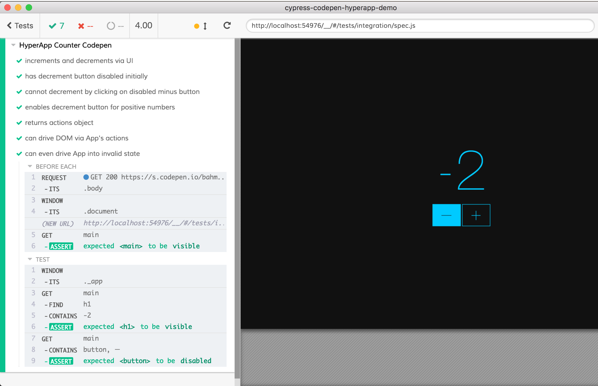

# Codepen.io Testing Demo

## Warning: no longer working

**Warning ⚠️**  Codepen.io has added a CAPTCHA to prevent scrapers and 3rd party tools from accessing the hosted web apps. The testing approach shown in this blog post no longer works, but we will keep it here for reference.

Demo of E2E testing HyperApp.js counter app running on Codepen.io.

- Load Codepen and get around iframe security restrictions.
- Use [`cy.request()`](https://on.cypress.io/api/request) to load a document into test iframe.
- Test [HyperApp.js](https://hyperapp.js.org/) application through the DOM and through actions.

## Blog Post

[Testing apps hosted on Codepen.io](https://www.cypress.io/blog/2017/12/05/testing-apps-hosted-on-codepen/)



Codepen [https://codepen.io/bahmutov/pen/ZaMxgz](https://codepen.io/bahmutov/pen/ZaMxgz)

**note:** before the better [lifecycle events land](https://github.com/cypress-io/cypress/issues/686) you need to wrap your application code on Codepen in IIFE

```js
(function() {
  const { h, app } = hyperapp;
  /** @jsx h */
  ...
}())
```
