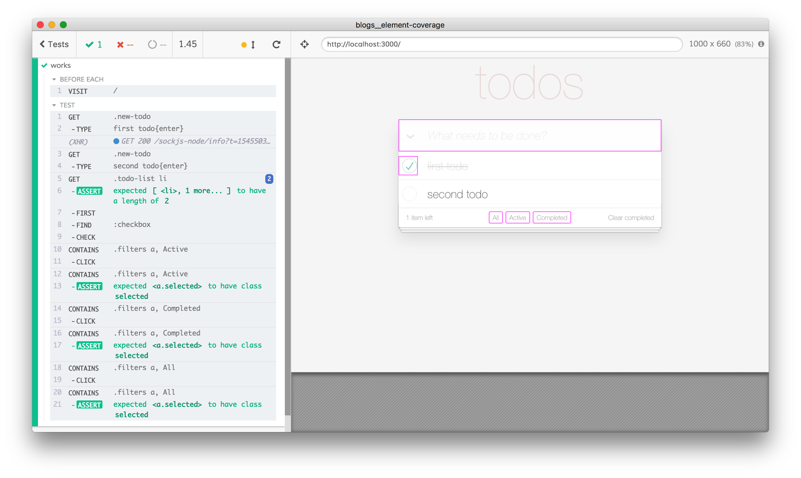

# Element coverage

Code for blog post [Element coverage](https://www.cypress.io/blog/2018/12/20/element-coverage/)

## Shows how to

- overwrite several built-in Cypress commands in [cypress/support/commands.js](cypress/support/commands.js) to keep track of elements the test interacts with
- draw elements after the tests finish

## Development

To make sure the server starts and builds the app _before_ the tests start on CI, [wait-on](https://github.com/jeffbski/wait-on#readme) utility is used to check on local port 3000 before running Cypress tests. See the NPM scripts in the [package.json](package.json) file.
