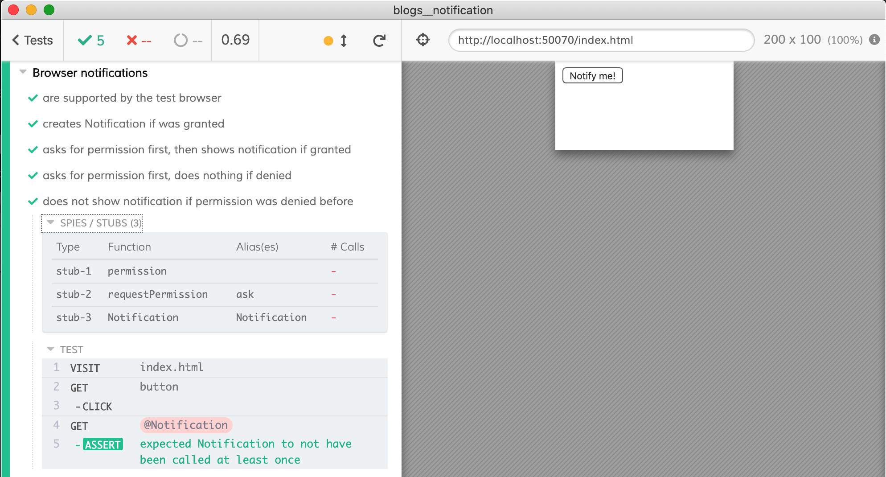
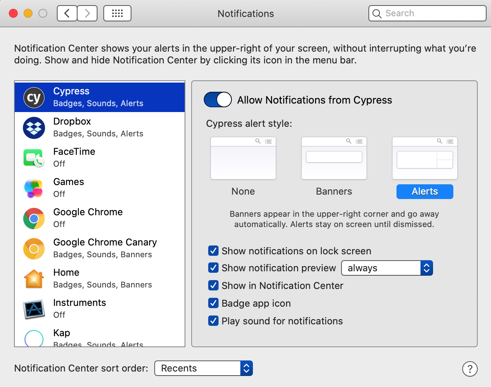

# Testing browser notifications

Read the blog post [Testing the Browser Notification API](https://www.cypress.io/blog/2020/01/24/testing-the-browser-notification-api/).

You can find the sample app in [index.html](index.html) and all tests in [cypress/integration/spec.js](cypress/integration/spec.js). The tests spy / stub Notification function in various ways to check how the app handles:
- permission was granted before
- permission was denied before
- permission was neither granted nor denied before, so the app asks the user and acts depending on the answer



## Checking if the browser supports notifications

The first test just checks that the browser supports notifications

```js
it('are supported by the test browser', () => {
  cy.visit('index.html')
  cy.window().should('have.property', 'Notification').should('be.a', 'function')
})
```

If you enable notifications from Cypress itself, you will see a popup if you click "Notify me!" button.




The rest of the tests stubs Notification constructor to avoid popups

## Testing if the browser does not support notifications

Application code
```js
// Let's check if the browser supports notifications
if (!("Notification" in window)) {
  alert("This browser does not support desktop notification");
  return
}
```

Test
```js
it('shows alert if the browser does not support notifications', () => {
  cy.visit('index.html', {
    onBeforeLoad (win) {
      delete win.Notification
    },
  })

  cy.on('window:alert', cy.stub().as('alerted'))
  cy.get('button').click()
  cy.get('@alerted').should('have.been.calledOnce')
  .and('have.been.calledWith', 'This browser does not support desktop notification')
})
```

## See also

- Cypress guide to [Stubs, spies and clocks](https://on.cypress.io/stubs-spies-and-clocks)
- Read [Mozilla Notification page](https://developer.mozilla.org/en-US/docs/Web/API/Notification)
- [`cy.stub`](https://on.cypress.io/stub)
- [Cypress Automation](https://glebbahmutov.com/blog/cypress-automation/)
