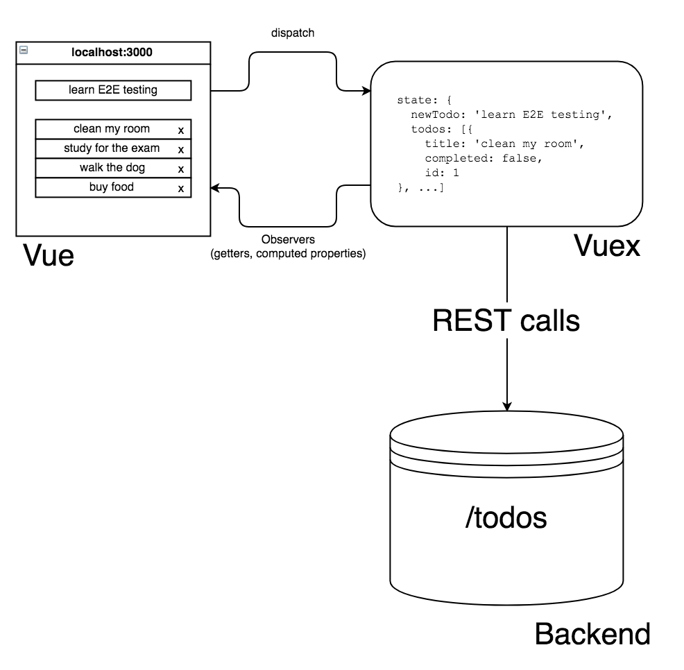
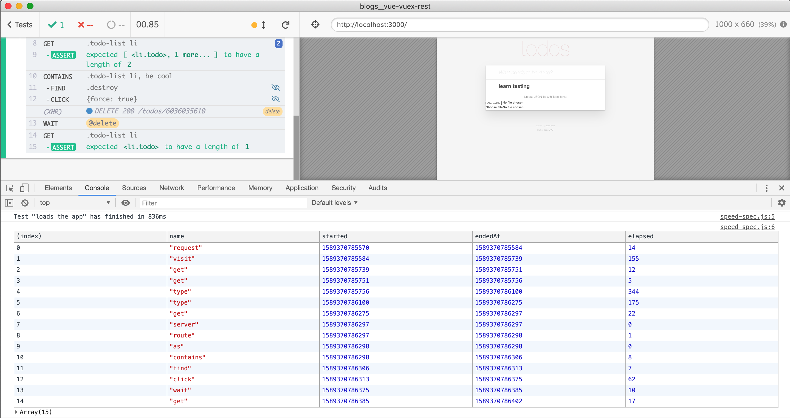

# Testing Vue + Vuex + REST application

Testing Vue + Vuex + REST TodoMVC using Cypress.

## Blog Post

[The blog post](https://www.cypress.io/blog/2017/11/28/testing-vue-web-application-with-vuex-data-store-and-rest-backend/)

## Shows how to

Spec files are in [cypress/integration](cypress/integration) folder

- test application through the GUI in [ui-spec.js](cypress/integration/ui-spec.js)
- mock REST calls to the server
- test application through the Vuex store in [store-spec.js](cypress/integration/store-spec.js)
- test application through REST calls in [api-spec.js](cypress/integration/api-spec.js)
- test text file upload

## Script commands

- `npm run reset:db` resets [data.json](data.json) to have empty list of todos

## Speed test

Spec file [cypress/integration/speed-spec.js](cypress/integration/speed-spec.js) shows how to get test and command timings.

