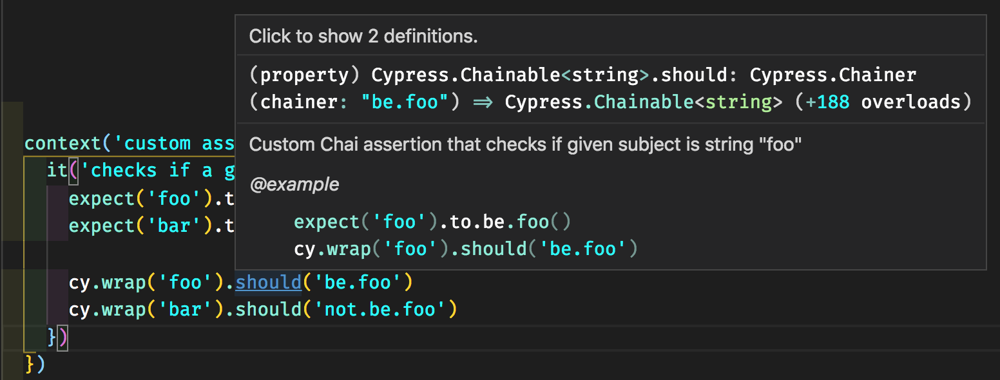

# Adding Chai Assertions

- Extend [`chai`](http://chaijs.com/) with the [`chai-date-string`](http://chaijs.com/plugins/chai-date-string/) assertion plugin from [cypress/support/index.js](cypress/support/index.js) so it is available in every spec file.
- Extend [`chai`](http://chaijs.com/) with the [`chai-colors`](http://chaijs.com/plugins/chai-colors/) assertion plugin in a single [spec file](cypress/integration/extending-chai-assertion-plugins-spec.js)
- Globally extend [`chai`](http://chaijs.com/) for all specs.
- Write and use own Chai assertion, see [cypress/support/index.js](cypress/support/index.js)

### Code completion

Even if you write your specs in JavaScript, you can have Intelligent Code Completion for custom assertions.

1. Add a `.d.ts` file with type definition and good JSDoc comment, for example here is [cypress/support/index.d.ts](cypress/support/index.d.ts).

```ts
// cypress/support/index.d.ts file
// extends Cypress assertion Chainer interface with
// the new assertion methods

/// <reference types="cypress" />

declare namespace Cypress {
  interface Chainer<Subject> {
    /**
     * Custom Chai assertion that checks if given subject is string "foo"
     *
     * @example
     ```
    expect('foo').to.be.foo()
    cy.wrap('foo').should('be.foo')
    ```
    * */
    (chainer: 'be.foo'): Chainable<Subject>

    /**
     * Custom Chai assertion that checks if given subject is NOT string "foo"
     *
     * @example
     ```
    expect('bar').to.not.be.foo()
    cy.wrap('bar').should('not.be.foo')
    ```
    * */
   (chainer: 'not.be.foo'): Chainable<Subject>
  }
}
```

2. In the spec file add special comment `reference path` pointing at the `.d.ts` file to load it.

```js
/// <reference types="Cypress" />
/// <reference path="../support/index.d.ts" />
```

In a modern code editor like VSCode you should see IntelliSense pop up when hovering over the new assertion method.



**Related:** [IntelliSense for custom Cypress commands](https://github.com/cypress-io/cypress-example-todomvc#custom-commands)
