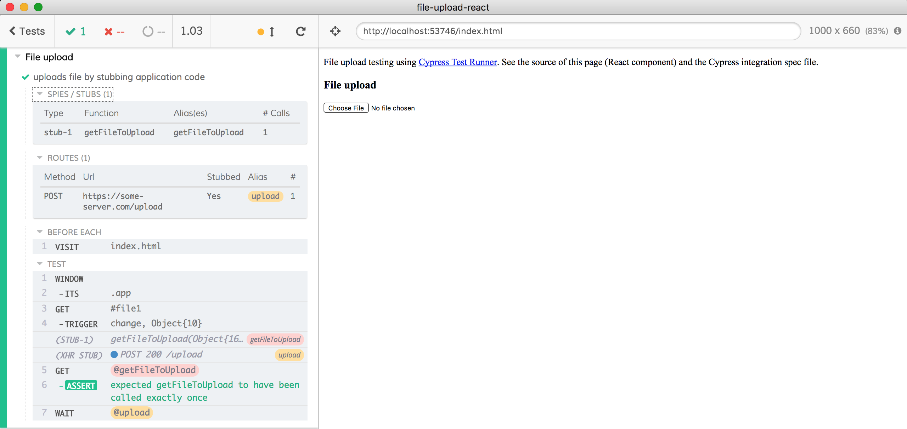

# file-upload-react

Tests React component that uploads a file. React source is in [index.html](index.html), spec files in [cypress/integration](cypress/integration) folder. To run tests

```shell
npm run cypress:open
```

## Tests

### [spec.js](cypress/integration/spec.js)

- The tests are trying to pass a synthetic test file to upload via an [`.trigger('change')`](https://on.cypress.io/trigger) event passing `File` reference using event property `testFile`. In the source code we try to grab this property before accessing the native file reference (which Cypress cannot set until we can fire the native file upload event)

```js
// application code tries to grab the File reference from "testFile" property
// which is set by the end-to-end Cypress test
const file = e.nativeEvent.testFile || e.nativeEvent.target.files[0]
```

We can confirm that the file gets uploaded by stubbing either XHR request or intercepting the `axios` library method used by the application's code to actually perform the file upload. See the `spec.js` how to:

- Stub remote server using [`cy.route()`](https://on.cypress.io/route)
- Alternatively stub `axios.post` method using [`cy.stub()`](https://on.cypress.io/stub)

### [upload-plugin-spec.js](cypress/integration/upload-plugin-spec.js)

- uses [`cypress-file-upload`](https://github.com/abramenal/cypress-file-upload) for file upload via `input` event

### [upload-via-app-spec.js](cypress/integration/upload-via-app-spec.js)

The most generic way to bypass all native event restrictions is to factor out accessing native `change` event to extract the file into the tiniest application method and stub it from the end-to-end test. Here is the relevant application code:

```js
// browser will run "fileUpload" on change event
<input id="file1" type="file" onChange={this.fileUpload}/>
// inside our component's code
fileUpload (e) {
  const file = this.getFileToUpload(e)
  // upload returned file
},
getFileToUpload (e) {
  // either upload file directly from the event (from a test)
  // or from the DOM file input list
  return e.nativeEvent.testFile || e.nativeEvent.target.files[0]
}
// we set the initialized application instance on the "window" object
// to let test methods access "app.getFileToUpload"
let app = ReactDOM.render(
  <FileUploadApp/>,
  document.getElementById('app')
);
// if the application is being tested from Cypress
// pass the reference to the application instance
// via "window" object, so the tests can directly interact with the app
if (window.Cypress) {
  window.app = app
}
```

Notice how we factored out accessing the `nativeEvent.target.files` into its own JavaScript method `getFileToUpload`? This allows us to stub _just that application method_ from the end-to-end test.

```js
const testFile = new File(['data to upload'], 'upload.txt')
// directly stub the application method that returns the File object to upload
cy.window().its('app')
  .then((app) => {
    cy.stub(app, 'getFileToUpload').returns(testFile)
  })
```

The rest of the application's code runs "normally" without any stubbing.



Check out a blog post that describes this technique in general ["Shrink the Untestable Code With App Actions And Effects"](https://www.cypress.io/blog/2019/02/28/shrink-the-untestable-code-with-app-actions-and-effects/)
