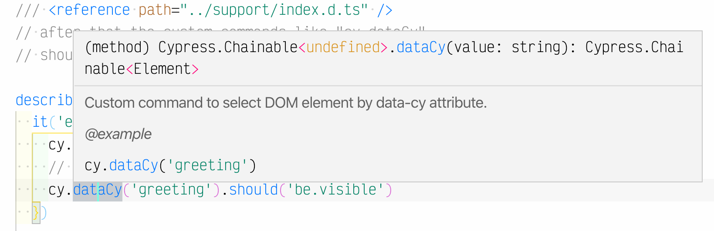

# add custom command in TypeScript
> Write your own Cypress commands using TypeScript

In this recipe we do not use `tsconfig.json` file, thus we need to specify additional command types using `/// <reference ...>` commands, like this:

```js
// cypress/integration/spec.ts
/// <reference path="../support/index.d.ts" />
```



See [cypress/support/index.ts](cypress/support/index.ts) and [cypress/support/index.d.ts](cypress/support/index.d.ts).
