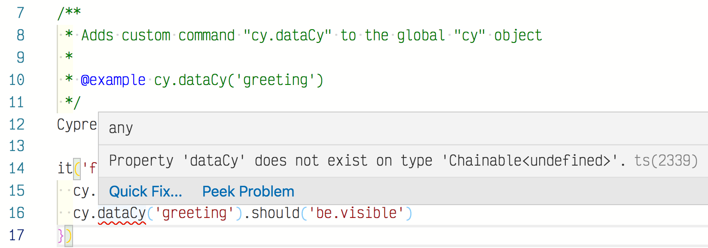
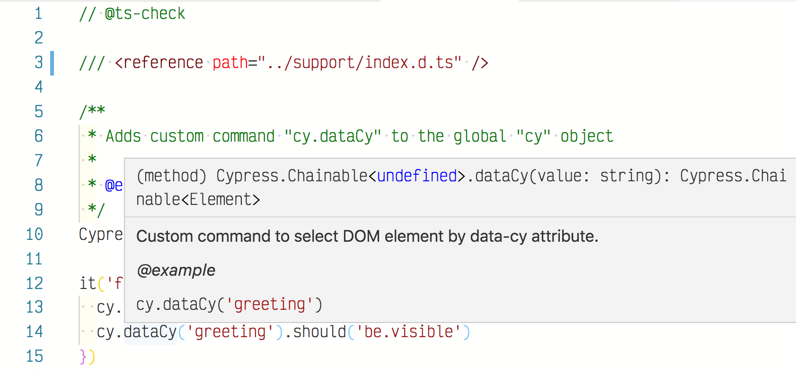

# add-custom-command
> Write your own Cypress commands

## Adding custom commands

You write Cypress custom command, for example for selecting DOM elements by `data-cy` attribute like this:

```js
/**
 * Adds custom command "cy.dataCy" to the global "cy" object
 *
 * @example cy.dataCy('greeting')
 */
Cypress.Commands.add('dataCy', (value) => cy.get(`[data-cy=${value}]`))
```

Yet, TypeScript compiler and IntelliSense do not understand that you have added a new method to the global `cy` object.



To add the new method to the global `cy` you need to add a separate TypeScript file like [cypress/support/index.d.ts](cypress/support/index.d.ts) and list the new `cy` methods there.

```ts
declare namespace Cypress {
  interface Chainable {
    /**
     * Custom command to select DOM element by data-cy attribute.
     * @example cy.dataCy('greeting')
    */
    dataCy(value: string): Chainable<Element>
  }
}
```

From your JavaScript spec file, use a special triple slash directive to load the new file by relative path:

```js
/// <reference path="../support/index.d.ts" />
```

And the TypeScript and IntelliSense should be happy



## 3rd party modules

As an example this spec includes 3rd party module [cypress-wait-until](https://github.com/NoriSte/cypress-wait-until). This module ships with its own TypeScript definition, which allows `cy.waitUntil` to work.

## More info

- [Cypress custom commands](https://on.cypress.io/custom-commands)
