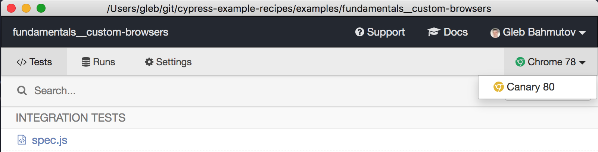

# Custom browsers

Cypress v3.7.0+ allows the project to customize the list of browsers. In this example, [cypress/plugins/index.js](cypress/plugins/index.js) filters the list of all browsers detected on the user's machine and only returns the bundled Electron browser. Or you could do the opposite and only allow the project to use Chrome browsers

```js
// cypress/plugins/index.js
module.exports = (on, config) => {
  return {
    browsers: config.browsers.filter((browser) => browser.family === 'chrome'),
  }
}
```



## Custom browser

Plugins file can also adjust or overwrite the list of browsers. For example [cypress/plugins/brave.js](cypress/plugins/brave.js) file finds the Brave Browser and returns only that browser.

```shell
npx cypress open --config pluginsFile=cypress/plugins/brave.js
```


If you want to use Brave browser during non-interactive run, pass its name

```shell
npx cypress run --config pluginsFile=cypress/plugins/brave.js --browser brave
```

**Tip:** if you are passing lots of `--config` options, set them in a new configuration file, like `cypress-brave.json` and use

```shell
npx cypress run --config-file cypress-brave.json
```
