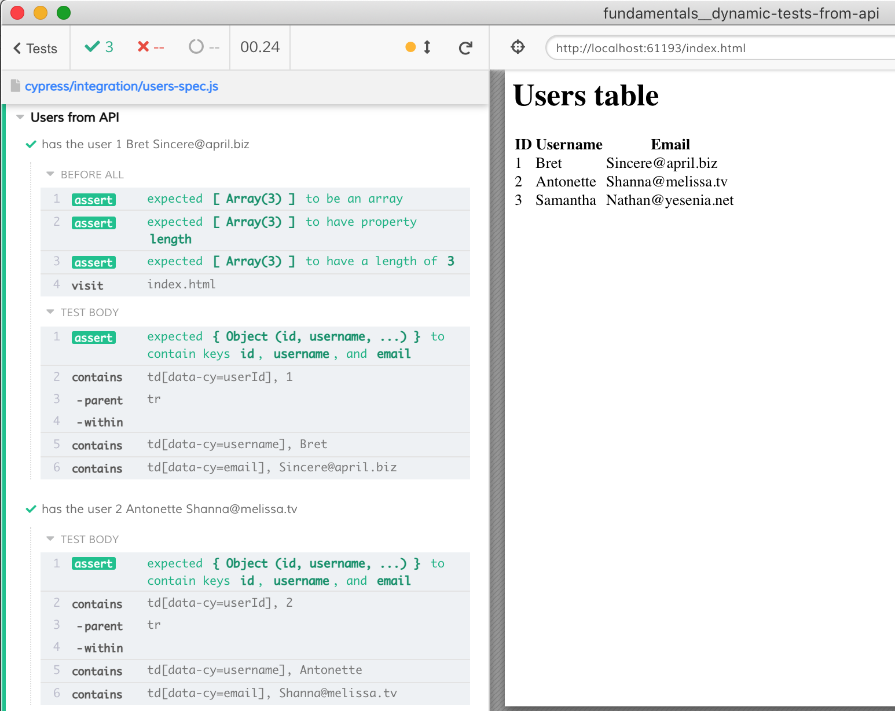

# Dynamic tests from fetched data

Sometimes you want to generate tests dynamically from data fetched from the external API. Because we cannot add more tests after the spec has already started, we need to fetch the test data _before_ the spec file starts.

We can do this from the [setupNodeEvents](cypress.config.js) function. We can call the external API server, parse the returned list of test objects, and then set the list of records in the `config.env` object. This config object will be available in each spec file. You then can get the list of test records before the tests are created, see the [users-spec.cy.js](./cypress/e2e/users-spec.cy.js)

