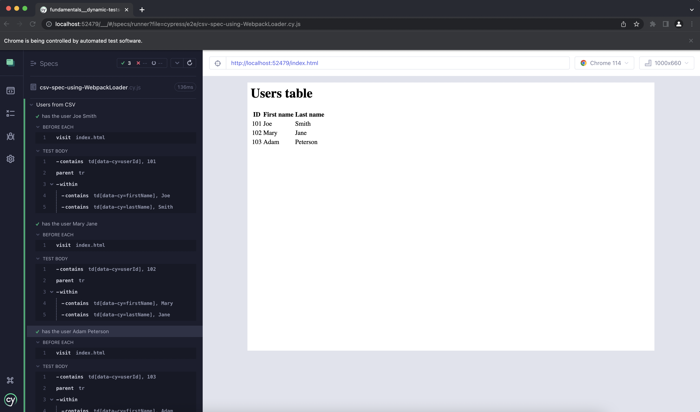

# Dynamic tests from CSV data using Webpack Preprocessor

There are times when you need to generate tests using external sources such as CSV. We cannot load the CSV file directly from the spec file (unless we have a special CSV file bundler), and we cannot use the `cy.readFile` command - because by then it is too late to define new tests. However we can use `@cypress/webpack-preprocessor` and `csv-loader` thus giving us the ability to load the files and best part of you dont have to specify them in the your `cypress.config.js` each time a new CSV file is to be used.

We can do this by adding those two new devDependencies in `package.json` and then load them in [setupNodeEvents](cypress.config.js) function. This config object will be available in each spec file. You then can get the list of records before the tests are created, see [csv-spec-using-WebpackLoader.cy.js](./cypress/e2e/csv-spec-using-WebpackLoader.cy.js)

```js
//package.json
"devDependencies": {
    "@cypress/webpack-preprocessor": "^5.17.1",
    "csv-loader": "^3.0.5"
  }

// `setupNodeEvents`
const webpackPreprocessor = require('@cypress/webpack-preprocessor')
const { defineConfig } = require('cypress')
module.exports = defineConfig({
  e2e: {
    supportFile: false,
    setupNodeEvents (on, config) {
      const webpackDefaults = webpackPreprocessor.defaultOptions
      webpackDefaults.webpackOptions.module.rules.push({
        test: /\.csv$/,
        loader: 'csv-loader',
        options: {
          dynamicTyping: true,
          header: true,
          skipEmptyLines: true,
        },
      })
      on('file:preprocessor', webpackPreprocessor(webpackDefaults))
    },
  },
})


// cypress/e2e/csv-spec.cy.js
const csvUsers = require('../fixtures/users.csv')

csvUsers.forEach((user) => {
    it(`has the user ${user['first name']} ${user['last name']}`, () => {
      cy.contains('td[data-cy=userId]', user['user id'])
      .parent('tr')
      .within(() => {
        cy.contains('td[data-cy=firstName]', user['first name'])
        cy.contains('td[data-cy=lastName]', user['last name'])
      })
    })
  })
```


