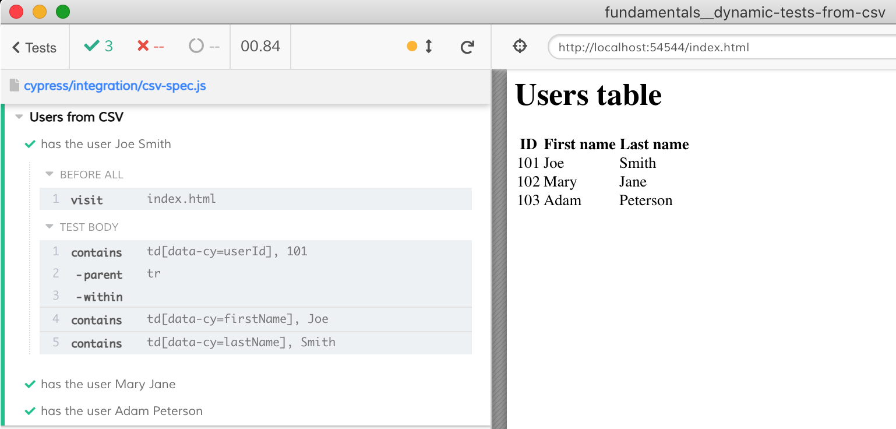

# Dynamic tests from CSV data

Sometimes you want to generate tests dynamically from a CSV file. We cannot load the CSV file directly from the spec file (unless we have a special CSV file bundler), and we cannot use the `cy.readFile` command - because by then it is too late to define new tests. Thus we need to load the CSV file _before_ the spec file starts.

We can do this from the [setupNodeEvents](cypress.config.js) function. It has access to the file system, can load the CSV file, parse it, then set the list of records in the `config.env` object. This config object will be available in each spec file. You then can get the list of records before the tests are created, see [csv-spec.cy.js](./cypress/e2e/csv-spec.cy.js)

```js
// `setupNodeEvents`
const text = fs.readFileSync(filename, 'utf8')
const csv = await neatCSV(text)
config.env.usersList = csv
return config

// cypress/e2e/csv-spec.cy.js
const csvUsers = Cypress.env('usersList')

csvUsers.forEach(user => {
  it(`has the user ${user['first name']} ${user['last name']}`, () => {
    ...
  })
})
```


