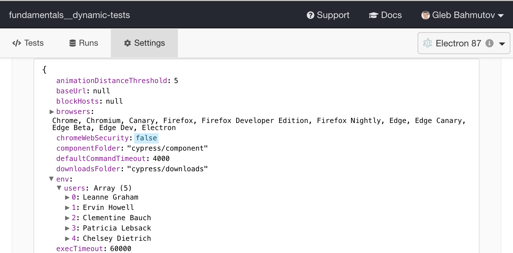

# Dynamic tests

Sometimes you want to iterate through a list of items, and for each item create a separate test. These tests are called _dynamic tests_. Examples of dynamic tests are:

- run same test against different viewport resolutions
- run same test against different sub-domains of your site
- generate tests based on the fetched data
- get the dynamic data from the plugin file before the tests start

## Note

Sometimes the data to generate tests might be dynamic and come from an external source. You cannot ask for this kind of data _from the test_ itself or from `before` hook, since it is too late. There are several workarounds:

1. you can fetch data using a script that runs _before_ Cypress starts. Save the results as a JSON file and load data using `require`. This has an advantage that the data does not change while running the tests, making debugging simpler. See suite called "generated from fixture" for an example.
2. you can fetch the dynamic data before the tests and save as a local variable or context property, then have multiple tests assert against dynamic data items.
3. you can get the data to use to create dynamic tests using [`cy.task`](https://on.cypress.io/task)
4. you can get the data during the plugin file start and place the result into `Cypress.env()` object to pass to the specs

## Examples

In these repo you can find:

- [cypress/integration/list-spec.js](cypress/integration/list-spec.js) iterates through an array, creating a test for each item
- [cypress/integration/viewports-spec.js](cypress/integration/viewports-spec.js) runs the same test against different viewports
- [cypress/integration/subdomains-spec.js](cypress/integration/subdomains-spec.js) runs the same test against different urls
- [cypress/integration/fixture-spec.js](cypress/integration/fixture-spec.js) uses `require` to load JSON fixture file and generates tests for each item from the fixture.
- [cypress/integration/request-spec.js](cypress/integration/request-spec.js) fetches a list of users from an external API endpoint and creates a test for each user
- [cypress/integration/task-spec.js](cypress/integration/task-spec.js) gets a list of items by calling [`cy.task`](https://on.cypress.io/task) and then generating a test for each item
- [cypress/integration/plugin-spec.js](./cypress/integration/plugin-spec.js) gets the list of users on start up, see [cypress/plugins/index.js](./cypress/plugins/index.js) file. You can see the fetched list in the `Cypress.env()` object

