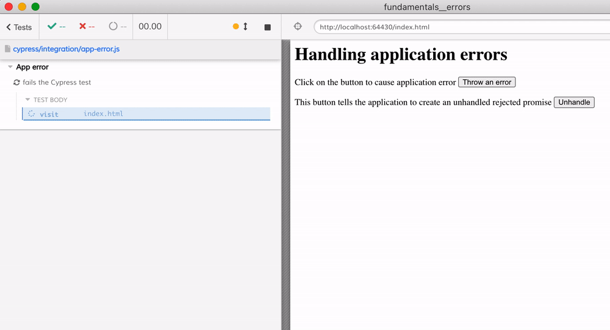
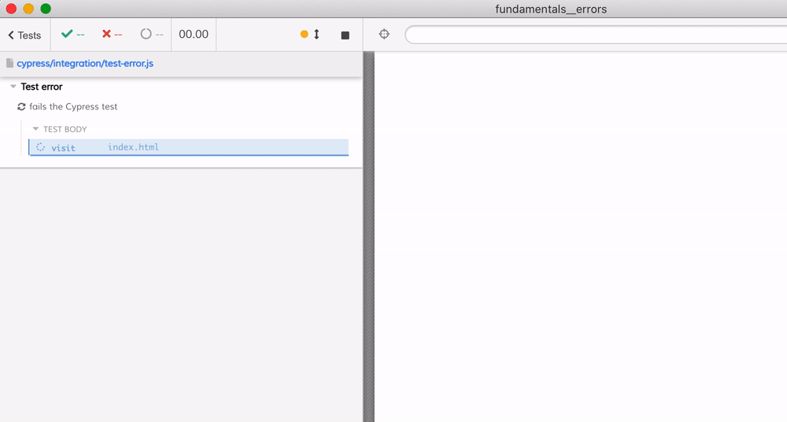

# Handling application errors

For more details, see [Cypress catalogue of events](https://on.cypress.io/catalog-of-events)

## Exceptions

If an application throws an error, it fails the Cypress test automatically.



You can see how to ignore such errors in [cypress/integration/app-error.js](./cypress/integration/app-error.js) spec file.

```js
// inspect the caught error
cy.on('uncaught:exception', (e) => {
  if (e.message.includes('Things went bad')) {
    // we expected this error, so let's ignore it
    // and let the test continue
    return false
  }
  // on any other error message the test fails
})
```

Make sure the test is long enough or waits for the error to happen!

See short video about this topic here: [https://www.youtube.com/watch?v=DwVezYq4zPM](https://www.youtube.com/watch?v=DwVezYq4zPM)

## Test fails

If a Cypress command fails, the test fails



You can listen to the "fail" events and return false to NOT fail the test, as [cypress/integration/test-fails.js](./cypress/integration/test-fails.js) shows.

## Unhandled promise rejections in the application

Cypress v7+ automatically fails the test if the application has an unhandled promise rejection event. See the [cypress/integration/unhandled-promise.js](./cypress/integration/unhandled-promise.js) spec file.

## Unhandled promise rejections in the test code

If your test code has an unhandled promise rejection, Cypress test happily continues. You can register handlers to fail the test. See [cypress/integration/unhandled-promise-in-test.js](./cypress/integration/unhandled-promise-in-test.js), but you have two choices:

If the test code uses [Cypress.Promise](https://on.cypress.io/promise) API, then:

```js
Cypress.Promise.onPossiblyUnhandledRejection((error, promise) => {
  throw error
})
```

If the test code uses native `window.Promise` then register a window event listener

```js
window.addEventListener('unhandledrejection', (event) => {
  throw event.reason
})
```

**Note:** because this is the test `window` object, such listeners are NOT reset before every test. You can register such listener once using `before` hook in the spec file.
