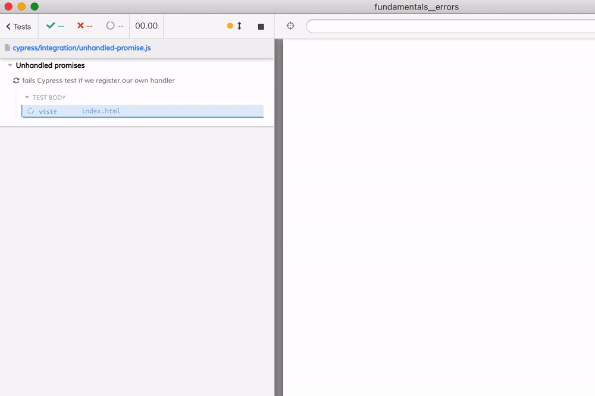

# Handling application errors

For more details, see [Cypress catalogue of events](https://on.cypress.io/catalog-of-events)

## Exceptions

If an application throws an error, it fails the Cypress test automatically.

You can see how to ignore such errors in [cypress/integration/app-error.js](./cypress/integration/app-error.js) spec file

## Test fails

If a Cypress command fails, the test fails

You can listen to the "fail" events and return false to NOT fail the test, as [cypress/integration/test-fails.js](./cypress/integration/test-fails.js) shows.

## Unhandled promise rejections

If the application code creates an unhandled rejected promise, Cypress does NOT see it by default and continues with the test. If you want to fail the test, listen to the unhandled promise event and throw an error.

You can register your own unhandled promise event listener during `cy.visit` as [cypress/integration/unhandled-promise.js](./cypress/integration/unhandled-promise.js) shows. Or you can register the window handler for all tests using `Cypress.on('window:before:load')` call, see [cypress/integration/unhandled-promise2.js](./cypress/integration/unhandled-promise2.js).
