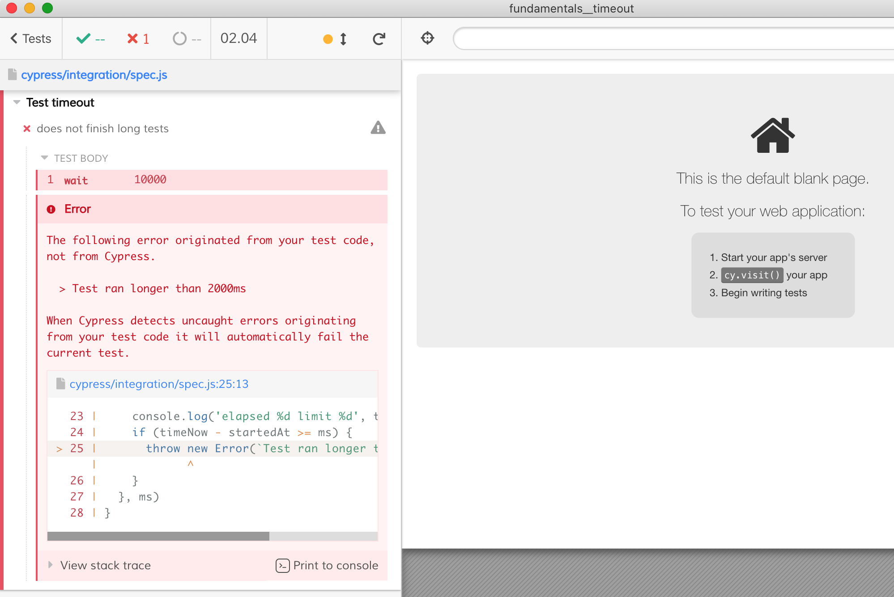

# Test timeout

The example shows how to stop a test if it takes too long to execute, similar to [Mocha's timeout](https://mochajs.org/#test-level) option. The timeout function is in [cypress/integration/timeout.js](cypress/integration/timeout.js).

You can set timeout inside the test only, see [cypress/integration/spec.js](cypress/integration/spec.js)

```js
// this test fails after two seconds due to timeout
it('does not finish long tests', () => {
  testTimeout(2 * 1000)
  cy.wait(10 * 1000)
})
```



You can set global timeout that applies to every test, see [cypress/integration/all-tests-spec.js](cypress/integration/all-tests-spec.js) using `Cypress.on('test:before:run' ...` event
