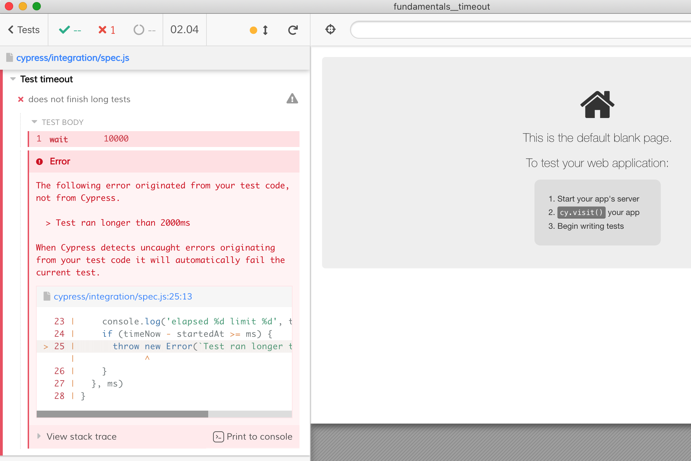

# Test timeout

The example shows how to stop a test if it takes too long to execute. The timeout function is in [cypress/e2e/timeout.cy.js](cypress/e2e/timeout.cy.js) and uses public Cypress API only.

## Why not Mocha's timeout?

[Mocha's `this.timeout(ms)`](https://mochajs.org/#test-level) is available in Cypress tests, but it does not limit how long the whole test runs. Cypress manages that timer itself: it restarts after every command, and `cy.wait(ms)` extends it by the time it waits. A test built from many commands can run far past `this.timeout(2000)` without ever failing, which is why this recipe measures the test from start to finish instead.

Reach for `this.timeout(ms)` when you want to give a *single* command more (or less) room, and for `testTimeout(ms)` when you want a budget for the *test*.

## Set the timeout inside a test

See [cypress/e2e/spec.cy.js](cypress/e2e/spec.cy.js)

```js
// this test fails after two seconds due to timeout
it('does not finish long tests', () => {
  testTimeout(2 * 1000)
  cy.wait(10 * 1000)
})
```



## Set the timeout for every test

Call `testTimeout` from a `beforeEach` hook, see [cypress/e2e/all-tests-spec.cy.js](cypress/e2e/all-tests-spec.cy.js). Move the same hook into your support file to limit every test in the project.

```js
beforeEach(() => {
  testTimeout(3 * 1000)
})
```
