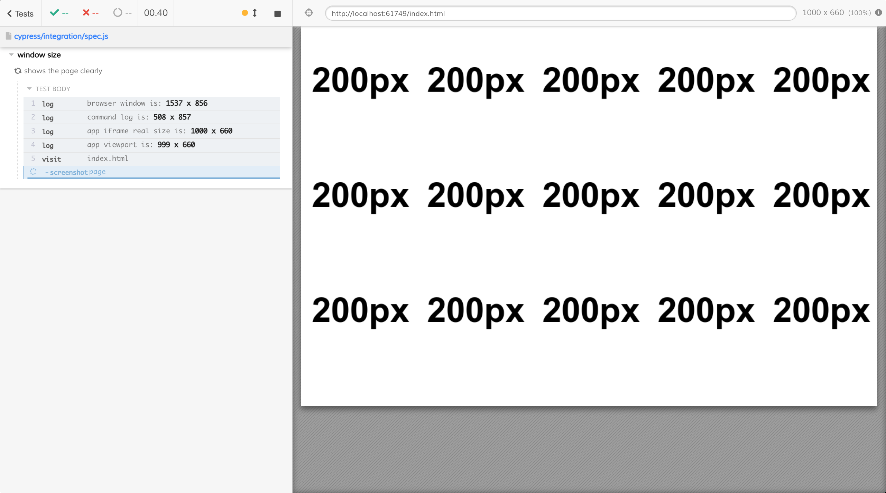

# Browser window size vs Application viewport

The browser window, the command log, and the application's iframe sizes are printed.

The [plugin file](./cypress/plugins/index.js) increases the browser window size when running in the headless mode to produce high quality video. See [launch api](https://on.cypress.io/browser-launch-api) for more documentation.

**Note:** increasing the browser window size seems to not work very well in Electron browser

You can watch a short video explaining the viewport and window sizes 
