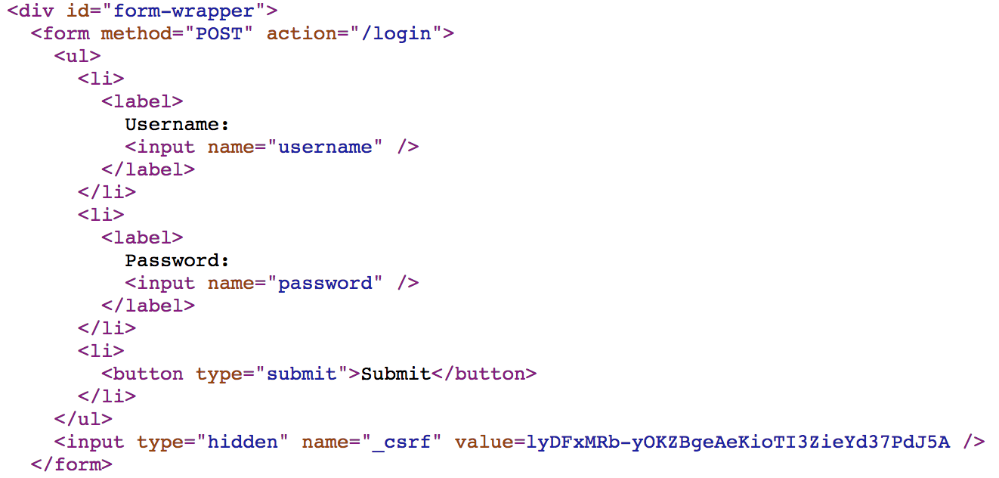
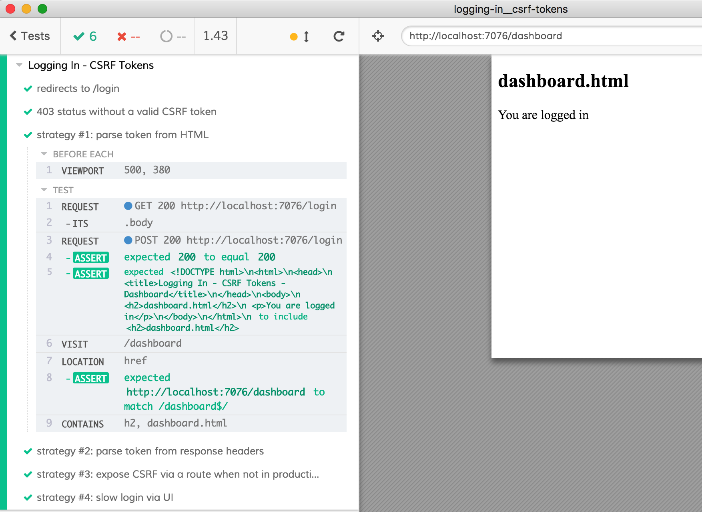

# logging-in-csrf-tokens

> Dealing with CSRF token when trying to login

If you start this application with `npm start` and open `localhost:7076` you will see a CSRF-protected login form [login.hbs](login.hbs). You can login with username `cypress` and password `password123` and get to the `/dashboard` view.

- Use [`cy.request()`](https://on.cypress.io/request) to get around CSRF protections.
- Parse CSRF tokens out of HTML.
- Parse CSRF tokens out of response headers.
- Expose CSRF via a route.
- Disable CSRF when not in production.

The tests in [cypress/integration/logging-in-csrf-tokens-spec.js](cypress/integration/logging-in-csrf-tokens-spec.js) show various approaches to logging with CSRF token, utilizing [`cy.request`](https://on.cypress.io/request) to log in.

**tip** to start the server and run Cypress GUI use script `npm run dev`

Highly recommended: watch video ["Organizing Tests, Logging In, Controlling State"](https://www.youtube.com/watch?v=5XQOK0v_YRE)
