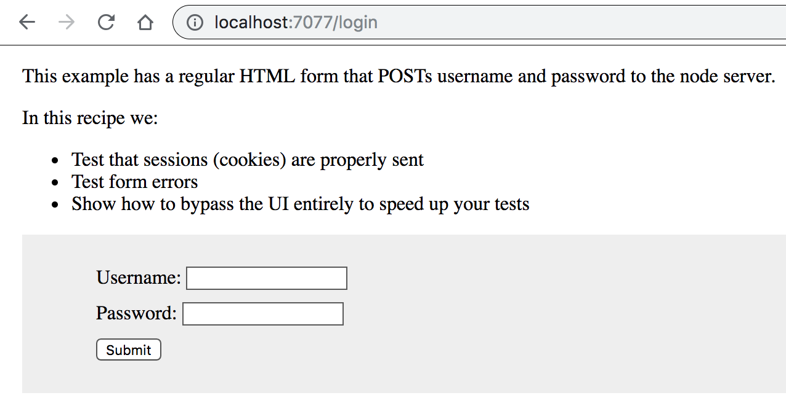

# logging-in-html-web-form

The tests in [cypress/integration/logging-in-html-web-form-spec.js](cypress/integration/logging-in-html-web-form-spec.js) show how log into protected website using a regular form like this:

- Test a standard `username/password` HTML form.
- Test errors submitting invalid data.
- Test unauthenticated redirects.
- Authenticate users with cookies.
- Create a custom `cy.login()` test command.
- Bypass needing to use your actual UI.
- Increase speed of testing with [`cy.request()`](https://on.cypress.io/request).

You should be able to log in with username "jane.lane" and password "password123".

**tip** to start the server and run Cypress GUI use script `npm run dev`

Highly recommended: watch video ["Organizing Tests, Logging In, Controlling State"](https://www.youtube.com/watch?v=5XQOK0v_YRE)
