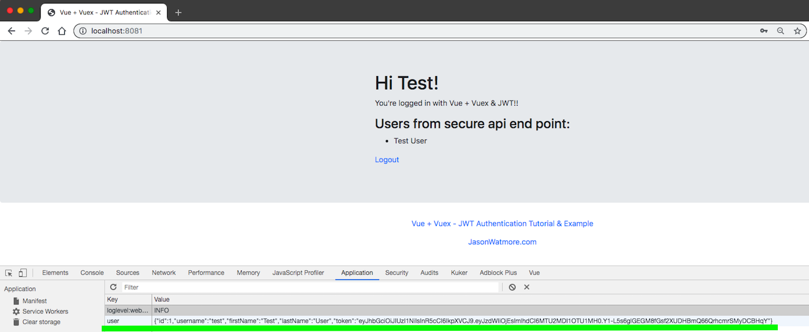

# logging-in__jwt
> Example of logging in using JWT

- Test login UI form
- Use [`cy.request()`](https://on.cypress.io/request) once to get user object and JWT
- Before each test set the JWT and the user object in `localStorage` before visiting the page
- The opened page instantly has the user logged in

## Server

Copied from [https://jasonwatmore.com/post/2018/08/06/nodejs-jwt-authentication-tutorial-with-example-api](https://jasonwatmore.com/post/2018/08/06/nodejs-jwt-authentication-tutorial-with-example-api)

```shell
npm run start:server
```

Runs the API at port 4000

## Front-end

Vue application copied from [https://jasonwatmore.com/post/2018/07/06/vue-vuex-jwt-authentication-tutorial-example](https://jasonwatmore.com/post/2018/07/06/vue-vuex-jwt-authentication-tutorial-example)

```shell
npm run start:app
```

Runs the web application at port 8081

The front-end SPA logs in and stores the JWT and user information in the `localStorage` item named `user`



All Ajax requests to the protected resources need to have `Authorization` header with the `Bearer <token>` value.


## Tests

- [cypress/integration/using-ui-spec.js](cypress/integration/using-ui-spec.js) tests the login user interface form
- [cypress/integration/spec.js](cypress/integration/spec.js) shows how to log in once using [cy.request](https://on.cypress.io/request) and then set the JWT in the `localStorage` to log in instantly before each test
