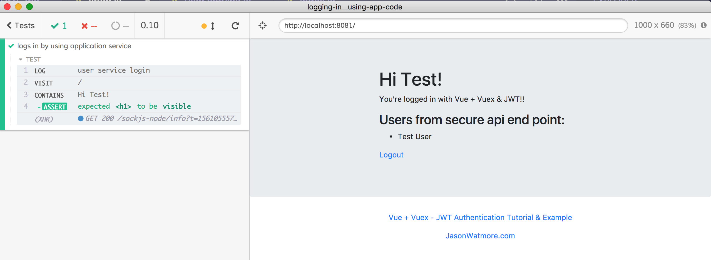

# logging-in__using-app-code
> Example of logging in using application code

Application copied from [../logging-in__jwt](../logging-in__jwt) example.

This example shows how you can use your own application code to log in. The "normal" application logs in at [src/_services/user.service.js](src/_services/user.service.js) given username and password. From our [cypress/integration/spec.js](cypress/integration/spec.js) file, we can import this service and use [`cy.wrap()`](https://on.cypress.io/wrap) to wait for the returned promise to resolve before continuing with the test.

The spec also shows how to wrap application code in a custom command, which is automatically wrapped.

**note:** in order to import the login service, we need to bundle the spec code using the same webpack bundler configuration as the application code. We do it by using the [cypress-webpack-preprocessor](https://github.com/cypress-io/cypress-webpack-preprocessor), see [cypress/plugins/index.js](cypress/plugins/index.js)
