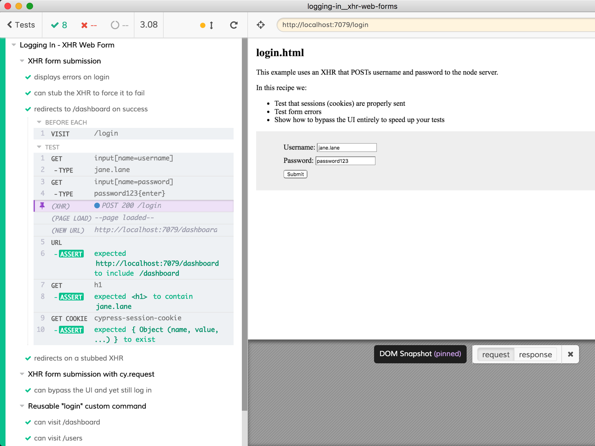

# logging-in-xhr-web-form

> Log into the server using XHR from end-to-end tests

See the login XHR code in [login.hbs](login.hbs)

- Test an AJAX backed `username/password` form.
- Test errors submitting invalid data.
- Stub JSON based XHR requests.
- Stub application functions.
- Create a custom `cy.login()` test command.
- Bypass needing to use your actual UI.
- Increase speed of testing with [`cy.request()`](https://on.cypress.io/request).

Test files in [cypress/integration](cypress/integration) folder show:

- in [logging-in-xhr-web-form-spec.js](cypress/integration/logging-in-xhr-web-form-spec.js) how to log in using the UI
- in [logging-via-request-spec.js](cypress/integration/logging-via-request-spec.js) how to login using [`cy.request`](https://on.cypress.io/request)
- in [custom-command-spec.js](cypress/integration/custom-command-spec.js) how to write a custom `cy.loginByJSON` command to abstract the quick login using `cy.request`
- in [slow-login-spec.js](cypress/integration/slow-login-spec.js) how to login just once and then reuse the session cookie in each test

**tip** to start the server and run Cypress GUI use script `npm run dev`

Highly recommended: watch video ["Organizing Tests, Logging In, Controlling State"](https://www.youtube.com/watch?v=5XQOK0v_YRE)
