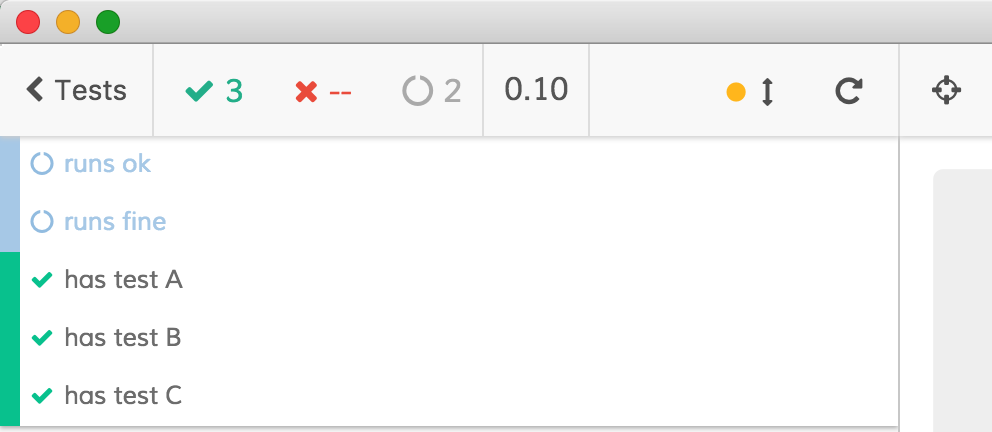

# Selecting tests using Mocha-like "fgrep" and "grep"

This example uses [cypress-select-tests](https://github.com/bahmutov/cypress-select-tests) preprocessor plugin to filter specs and tests. It is similar to how [Mocha](https://mochajs.org/) has `--fgrep` and `--grep` CLI arguments. This project provides imitation using strings.

Because Cypress ignores unknown CLI parameters, you need to pass `fgrep` and `grep` arguments as environment variables, for example by using `--env` CLI argument.

## Examples

### fgrep to pick specs

```bash
# runs only tests from specs with "foo" in their filename
$ npm run cypress:open -- --env fgrep=foo
```

Running all tests shows that all tests are skipped, except for tests in file [cypress/integration/foo.js](cypress/integration/foo.js)



### grep to pick tests

```bash
# runs in headless mode, skipping all but one matching test
$ npm run cypress:run -- --env grep='runs fine'
```

produces

```text
  Running: bar.js...         (1 of 2)
picking tests to run in file cypress/integration/bar.js

  - runs ok
  ✓ runs fine (38ms)

  1 passing (67ms)
  1 pending

  Running: foo.js...         (2 of 2)
picking tests to run in file cypress/integration/foo.js

  - has test A
  - has test B
  - has test C

  0 passing (33ms)
  3 pending
```

## Notes

Note how you need to use `--` to separate NPM open or run script command from arguments to Cypress itself.

Separate multiple environment variables with commas

```bash
# runs only tests with "works" from specs with "foo"
$ npm run cypress:run -- --env fgrep=foo,grep=works
```

If you want to pass string with spaces, please quote it like

```bash
$ npm run cypress:run -- --env grep='feature A'
```

## Details

See [cypress/plugins/index.js](cypress/plugins/index.js) file how to configure test selection preprocessor, built on top of [Cypress Browserify preprocessor](https://github.com/cypress-io/cypress-browserify-preprocessor).
