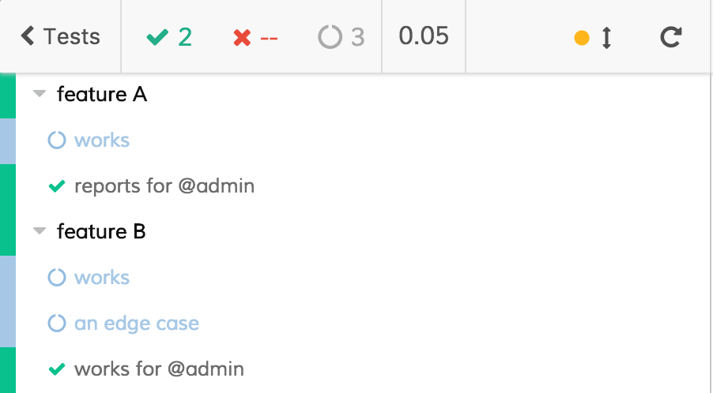

# Selecting tests using Mocha-like "grep"

This example uses [cypress-select-tests](https://github.com/bahmutov/cypress-select-tests) preprocessor plugin to filter specs and tests. It is similar to how [Mocha](https://mochajs.org/) has `--grep` CLI argument. This project provides imitation using a string.

Because Cypress ignores unknown CLI parameters, you need to pass `grep` argument as an environment variables, for example by using `--env` CLI argument.

## Examples

Opens Cypress GUI but only allow running tests with `@admin` in their names

```bash
$ npm run cypress:open -- --env grep=@admin
```



Runs tests with `edge case` in their name in headless mode

```bash
$ npm run cypress:run -- --env grep='edge case'
```

produces

```text
Running: feature-a.js...     (1 of 2)
picking tests to run in file cypress/integration/feature-a.js


  feature A
    - works
    - reports for @admin


  0 passing (30ms)
  2 pending

  Running: feature-b.js...   (2 of 2)
picking tests to run in file cypress/integration/feature-b.js


  feature B
    - works
    ✓ an edge case (54ms)
    - works for @admin


  1 passing (87ms)
  2 pending
```

## Notes

### test title

The full test title used for string matching is a concatenation of suite names plus the test's own name.

```js
describe('app', () => {
  context('feature A', () => {
    it('works', () => {
      // full test name is 'app feature A works'
    })
  })
})
```

Thus you can run all tests form the given suite

```bash
$ npm run cypress:run -- --env grep='feature A'
```

## NPM arguments

Note how you need to use `--` to separate NPM open or run script command from arguments to Cypress itself.

```bash
# runs only tests with "works" in their name
$ npm run cypress:run -- --env grep=works
```

## Quote strings with spaces

If you want to pass string with spaces, please quote it like

```bash
$ npm run cypress:run -- --env grep='feature A'
```

## Details

See [cypress/plugins/index.js](cypress/plugins/index.js) file how to configure test selection preprocessor, built on top of [Cypress Browserify preprocessor](https://github.com/cypress-io/cypress-browserify-preprocessor).
