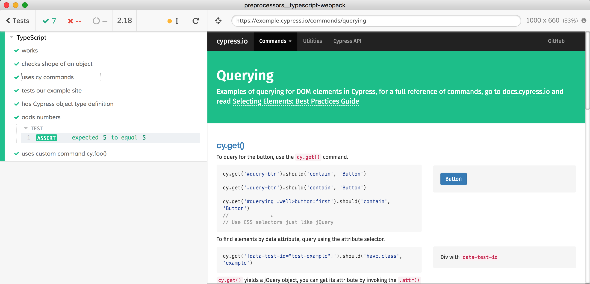
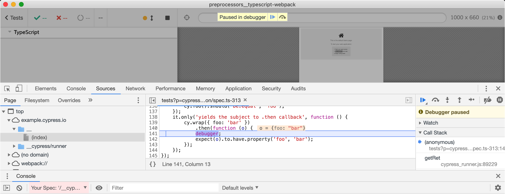

# Typescript with Webpack

This is an example showing TypeScript tests with Cypress using Webpack. See Cypress' [TypeScript Support](https://on.cypress.io/typescript-support) docs for more details.

- Uses [webpack](https://github.com/webpack/webpack) to transpile TypeScript tests via [@cypress/webpack-preprocessor](https://github.com/cypress-io/cypress-webpack-preprocessor)
- Lints TypeScript spec code against Cypress type definitions

## Install

Because this recipe is part of the monorepo with lots of examples, we don't want to install dependencies per-recipe, but instead use the common root dependencies. Thus when copying _just_ this recipe into its own project you would need to install the following dev dependencies:

- `webpack`
- `@cypress/webpack-preprocessor`
- `babel-loader`
- `@babel/preset-typescript`
- `typescript`

## See
- [webpack.config.js](webpack.config.js)
- [cypress/plugins/index.js](cypress/plugins/index.js)
- [cypress/integration/spec.ts](cypress/integration/spec.ts)

## Run

```shell
npm run cypress:open
```

Click `spec.ts`



## Commands

The E2E tests should run in Cypress right away. There are few other commands configured in this example recipe as a demonstration only.

- `npm run build` runs Webpack to convert spec TS file into `out.js`
- `npm run lint` lints TypeScript specs using [tslint](https://palantir.github.io/tslint) and then TypeScript compiler to type check test source files.

## Source maps

[webpack.config.js](webpack.config.js) sets the source maps, if there is `debugger` keyword or an exception from the TypeScript code, its position should be shown correctly.


