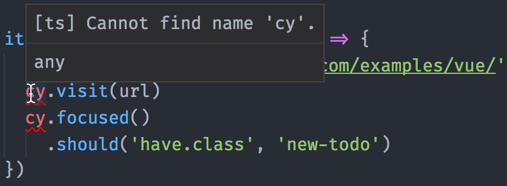
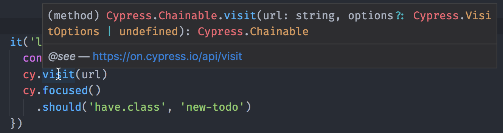

# Typescript with Webpack

This is an example showing TypeScript tests with Cypress using Webpack

It uses [webpack](https://github.com/webpack/webpack) to transpile TypeScript tests
via [@cypress/webpack-preprocessor](https://github.com/cypress-io/cypress-webpack-preprocessor)

See:
- [webpack.config.js](webpack.config.js)
- [cypress/plugins/index.js](cypress/plugins/index.js)
- [example test](cypress/integration/spec.ts)

## Notes

To get Mocha TypeScript definitions for `describe`, `it` and other BDD functions plus `cy` itself, install the typings.

```
npm install --save-dev @types/mocha @types/cypress
```

Without type definitions



With type definitions installed, you get IntelliSense


