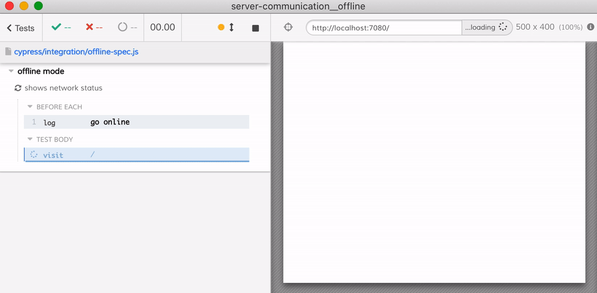

# Offline network test

- [offline-spec.cy.js](cypress/e2e/offline-spec.cy.js) simulates an offline network connection and tests how the application handles it

## How it simulates being offline

A browser going offline changes two separate things, and a test has to simulate both:

- **what the application believes about connectivity** — `window.navigator.onLine` plus the `online` and `offline` events. Defining `onLine` as an own property on `window.navigator` shadows the getter inherited from `Navigator.prototype`, and dispatching the matching event lets the application re-render.
- **the requests themselves failing** — [`cy.intercept()`](https://on.cypress.io/intercept). Where an entire test is offline, the static `{ forceNetworkError: true }` response is enough. Where connectivity has to flip mid-test, a request handler that calls [`req.destroy()`](https://on.cypress.io/intercept#Request-events) while a flag is set gives you both states from a single route.

Neither touches the browser's real network stack, so these tests run in Chrome, Firefox, Edge, WebKit, and Electron alike.

Because requests fail at the proxy rather than at the network interface, the browser still makes them. These tests assert that the application attempted a request and handled the failure, not that nothing left the machine.
