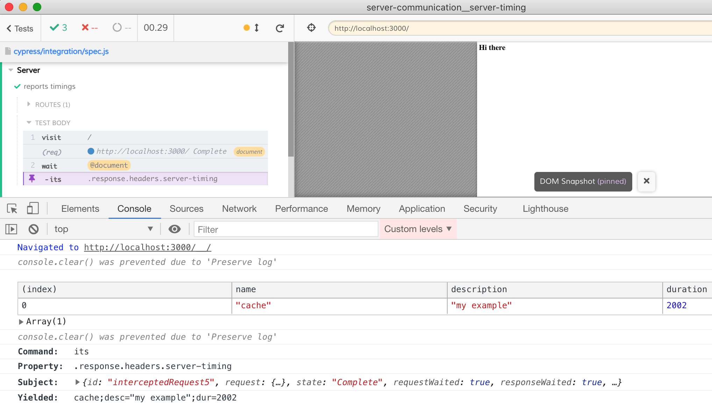
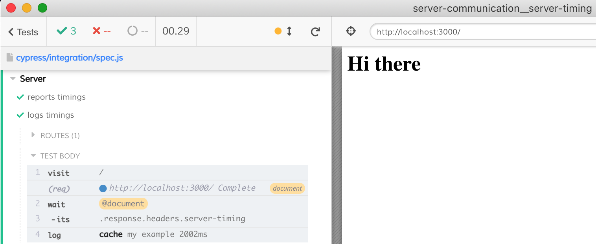
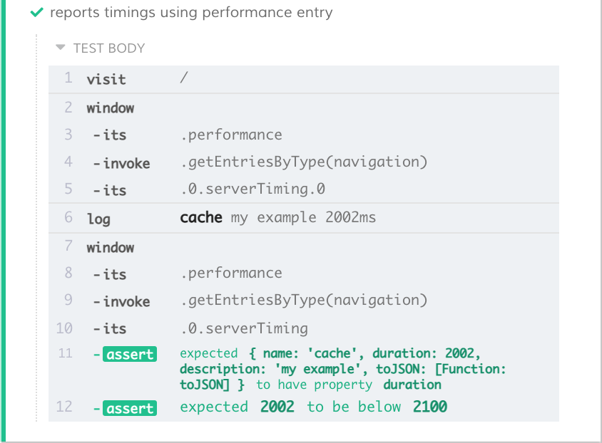

# Server Timing
> Show server timing results from Cypress visit

Imagine the server collects its performance timings while preparing and serving the `/` page. The server can send these timings using [Server-Timing](https://developer.mozilla.org/en-US/docs/Web/HTTP/Headers/Server-Timing) header (see [index.js](index.js)), and we can inspect these numbers from the Cypress test. See [cypress/integration/spec.js](cypress/integration/spec.js) file.

We can intercept the `/` load using [cy.intercept](https://on.cypress.io/intercept) and inspect the response's headers. We have to find the `server-timing` header and parse it ourselves.



Printing to the DevTools console hides the numbers, so instead we can print them to the Command Log using [cy.log](https://on.cypress.io/log)



We can also go about server timings the other way. Instead of spying on the `/` resource, we can let the page load and then access the performance object collected by the browser automatically. For example, we can get all server timings already parsed by the browser by accessing them:

```js
window.performance.getEntriesByType('navigation')[0]serverTiming
```

Which in Cypress test can be done

```js
cy.window().its('performance')
  .invoke('getEntriesByType', 'navigation')
  .its('0.serverTiming')
```

We can then find the desired duration and assert it is below certain limit


