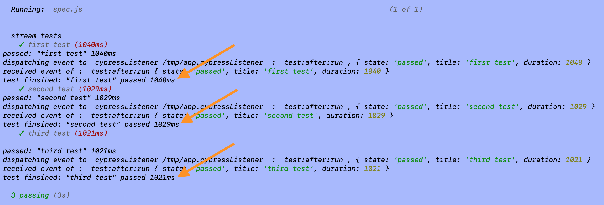

# stream-tests
> Run Cypress using NPM module API and receive event after each test finishes. Read blog post [Streaming Test Results](https://www.cypress.io/blog/2020/04/01/streaming-test-results/)


You can launch the testing process with `node .`. The script [index.js](index.js) runs the tests using [Cypress NPM module API](https://on.cypress.io/module-api)

```js
const cypress = require('cypress')
cypress.run().then(...)
```

Before `index.js` launches Cypress, it creates an inter process communication (IPC) server using [node-ipc](http://riaevangelist.github.io/node-ipc/) module. This server is listening at channel with ID `cypressListener`.

```js
// index.js
const cypress = require('cypress')
const ipc = require('node-ipc')

ipc.config.id = 'cypressListener'
ipc.serve(() => {
  cypress.run().then(...)

  // receive stream of events
  ipc.server.on('test:after:run', (data) => {
    console.log('test finsihed: "%s" %s %dms',
      data.title, data.state, data.duration)
  })
})
```

When Cypress starts, its background process is executing using Node the code in [cypress/plugins/index.js](cypress/plugins/index.js) file. This file can send messages back to the `cypressListener` process using IPC communication. In this particular recipe, we want to notify the `cypressListener` as soon as a test finishes running, we can do it on receiving a message from the Test Runner running in the browser via [cy.task](https://on.cypress.io/task) command.

```js
// cypress/plugins/index.js
const ipc = require('node-ipc')
ipc.connectTo('cypressListener')
on('task', {
  testFinished (attributes) {
    console.log('%s: "%s" %dms',
      attributes.state, attributes.title, attributes.duration)
    ipc.of.cypressListener.emit('test:after:run', {
      state: attributes.state,
      title: attributes.title,
      duration: attributes.duration,
    })

    return null
  },
})
```

Finally, in the browser, after each test we save the test final attributes: the title, the state, the duration (there are more, but we are only interested in those), and send them to the plugins background process either at the start of the next test, or after all tests finish, see [cypress/support/index.js](cypress/support/index.js) file.

```js
// cypress/support/index.js
let testAttributesToSend

const sendTestAttributes = () => {
  if (!testAttributesToSend) {
    return
  }

  console.log('sending test attributes: %s %s',
    testAttributesToSend.title, testAttributesToSend.state)

  const attr = testAttributesToSend

  testAttributesToSend = null

  cy.task('testFinished', attr)
}

beforeEach(sendTestAttributes)

after(sendTestAttributes)

Cypress.on('test:after:run', (attributes, test) => {
  testAttributesToSend = attributes
})
```

Every time the test finishes, its status and other attributes are saved. When the next test starts, the previous test results are sent to the plugins background process, where they are forwarded via IPC communication channel to the `cypressListener` server process. The server process can do any action desired: send notifications as soon as a test fails, push an event, etc. For example, it can print the test status in the terminal.



**Note:** we cannot invoke the `cy.task('testFinished')` from `Cypress.on('test:after:run')` callback, because it does not allow async code to execute, thus we need to use `beforeEach + after` trick to actually send each test result to the plugins background process.
