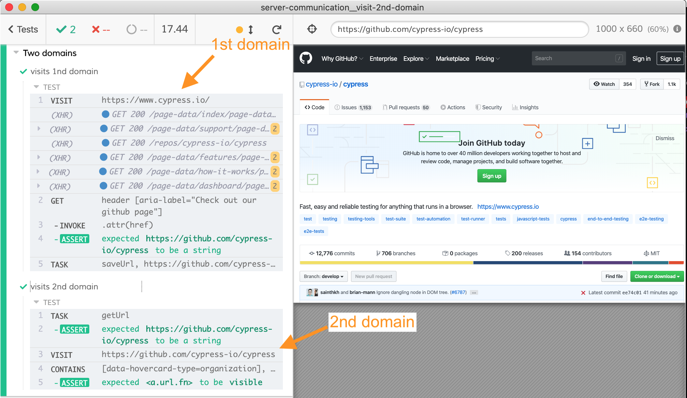

# visit-2nd-domain
> Visiting two different domains from two different tests



## THE WRONG WAY

Imagine a spec that visits two different domains:

```js
// 🚨 INCORRECT TEST FOR DEMO ONLY
describe('Two domains', () => {
  let myValue

  it('visits 1nd domain', () => {
    cy.visit('https://www.cypress.io/')
      .then(() => {
        // get the value X from the page
        myValue = X
      })
  })

  it('visits 2nd domain', () => {
    cy.visit('https://github.com')
      .then(() => {
        // use myValue
      })
  })
})
```

If you run the above spec you might notice a curious thing: the `myValue` is undefined in the second test, even if it was set correctly in the first test. The variable is set to null because Cypress has to reload the entire spec when visiting the second domain. This "restarts" the spec, losing all local closure variables.

The solution is to save the `myValue` not in a local variable, but in a more permanent location, unaffected by the spec restart. This recipe shows two such places: a file on disk and a variable in the plugin file.

## using task

The tests in [using-task-spec.js](cypress/integration/using-task-spec.js) store the intermediate URL in the plugins process.

The first test visits the first domain `https://www.cypress.io/`, finds link to Cypress Test Runner's GitHub repo and saves the `href` in the plugins process by using [cy.task](https://on.cypress.io/task). The plugin process keeps running preserving the variables, while the specs are started and stopped.

The second test gets the URL from the plugins process using [cy.task](https://on.cypress.io/task) and calls `cy.visit(<URL>)` and then confirms the GitHub page opens.

## using file

The tests in [using-file-spec.js](cypress/integration/using-file-spec.js) save the extracted URL in a local JSON file.

## See also

- recipe ["Pass value between specs"](https://github.com/cypress-io/cypress-example-recipes#server-communication)
