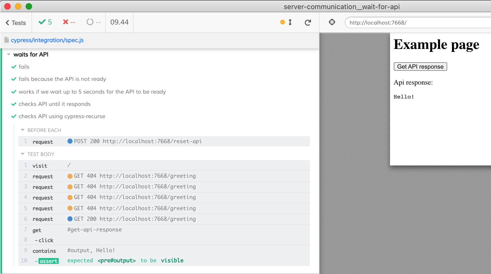

# Wait for API

Sometimes the backend API is not immediately ready and our test needs to wait. This recipe shows how to avoid hard-coded waits, and instead ping the API periodically using [cy.request](https://on.cypress.io/request). When we finally get the successful response, we know the API is ready and proceed with the rest of the test.

The recipe shows how to implement the network calls with retries via recursion or via [cypress-recurse](https://github.com/bahmutov/cypress-recurse)
