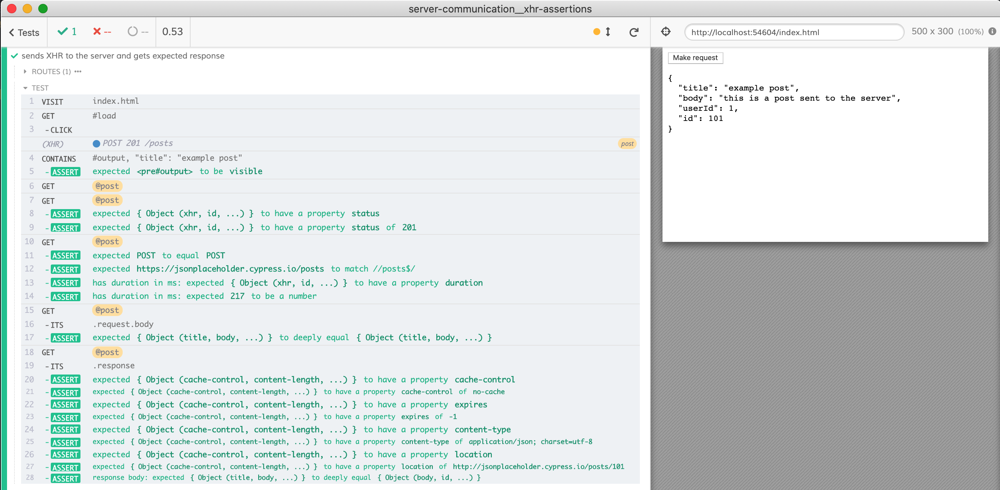
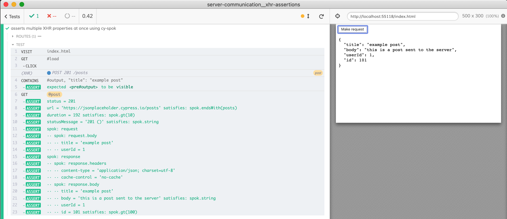
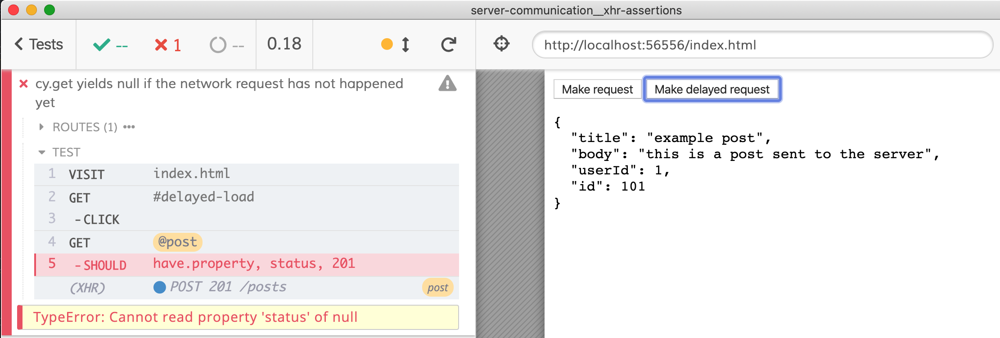
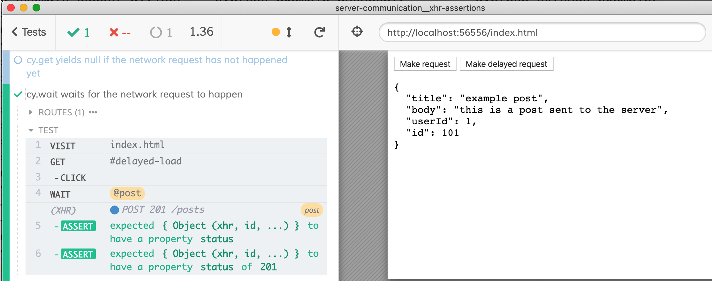
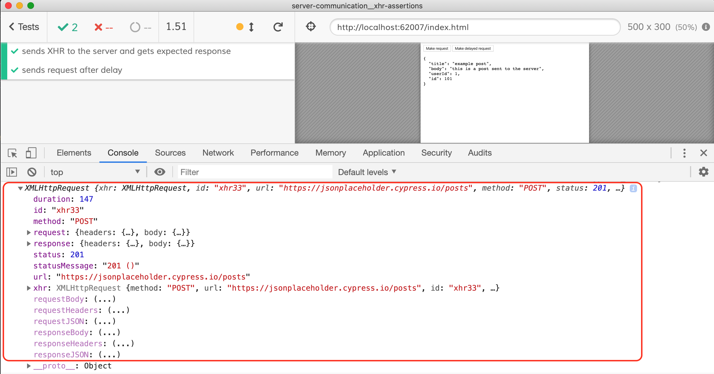
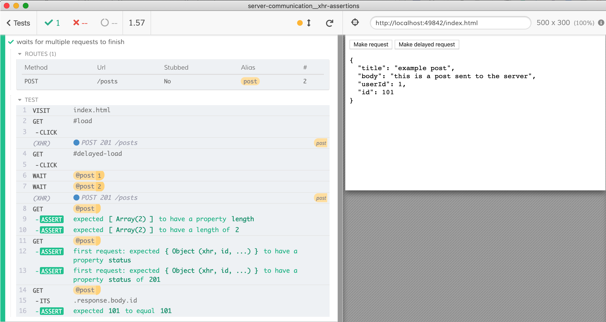
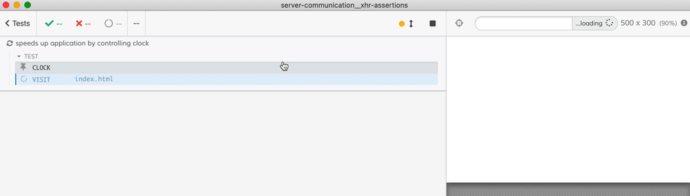
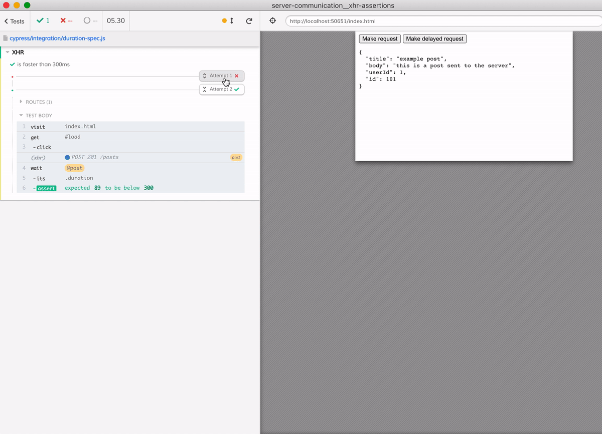

# Assertions checking network request and response

This recipe shows how to spy on a network call and assert its request and response data.

[cypress/e2e/spec.cy.js](cypress/e2e/spec.cy.js) runs multiple assertions against an XHR object



[cypress/e2e/spok-spec.cy.js](cypress/e2e/spok-spec.cy.js) asserts multiple values and schema properties using [cy-spok](https://github.com/bahmutov/cy-spok) plugin built on top of [spok](https://github.com/thlorenz/spok)



## cy.wait vs cy.get for network requests

Both `cy.get(<alias>)` and `cy.wait(<alias>)` can yield a network request, but there is a difference. The command [cy.wait](https://on.cypress.io/wait) will retry finding the matching request until the call is made, or the command times out. The command [cy.get](https://on.cypress.io/get) on the other hand, when dealing with aliases, just returns whatever it finds _at that moment_ and does not retry.

In a situation when the network call might not have happened yet, `cy.get` will fail. For example, the followig test fails

```js
it('waits for async network request using cy.wait', () => {
  cy.visit('index.html')

  cy.server()
  cy.route('POST', '/posts').as('post')

  cy.get('#delayed-load').click()
  // cy.get does NOT work
  // because it immediately returns null object,
  // since the request has not happened yet
  cy.get('@post').should('have.property', 'status', 201)
})
```


The command `cy.wait` retries and "waits" until the matching network call really happens. Same test, but the last lines passes

```js
cy.get('#delayed-load').click()
cy.wait('@post').should('have.property', 'status', 201)
```



Find the above tests in [cypress/e2e/wait-vs-get.cy.js](cypress/e2e/wait-vs-get.cy.js)

**Tip:** you can inspect the full XHR object by logging it to the console

```javascript
cy.wait('@post').then(console.log)
```



## Multiple requests

[cypress/e2e/multiple-requests.cy.js](cypress/e2e/multiple-requests.cy.js) shows how to wait for multiple matching requests and how to retrieve them all, or individually.



## Controlling the clock

We can skip the initial 1 second delay set using `setTimeout(..., 1000)` inside the application by controlling the application's clock. See [cypress/e2e/clock-control.cy.js](cypress/e2e/clock-control.cy.js).



## Test retries

If we decide to assert the network call's duration yet avoid specifying extremely large limit to avoid spurious test failures, we can use test retries to re-run the test. See [cypress/e2e/duration-spec.cy.js](cypress/e2e/duration-spec.cy.js)

```js
it('is faster than 300ms', { retries: 3 }, () => {
  ...
  cy.wait('@post').its('duration').should('be.lessThan', 300)
})
```



## XML responses

If the server is returning a XML response, you can parse it into a plain object and then confirm its properties. See the [server.js](./server.js) and the [cypress/e2e/xml-spec.cy.js](./cypress/e2e/xml-spec.cy.js) files.

## See also

- [Cypress network guide](https://on.cypress.io/network-requests)
- Cypress Testing Workshop [XHR chapter](https://github.com/cypress-io/testing-workshop-cypress#xhr)
