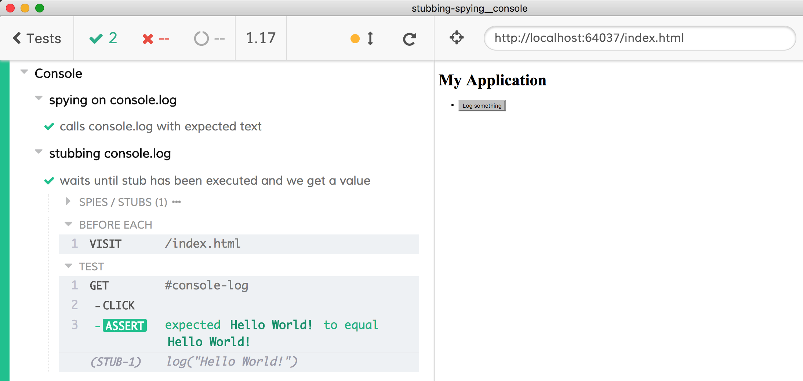

# Stubbing Console

The spec file [cypress/e2e/spec.cy.js](cypress/e2e/spec.cy.js) shows how to spy on and stub methods of the `console` object. See [index.html](index.html) to see what the "application" is logging on load.

## Learn more

- [`cy.spy()`](https://on.cypress.io/spy)
- [`cy.stub()`](https://on.cypress.io/stub)
- [`cy.visit()`](https://on.cypress.io/visit)
