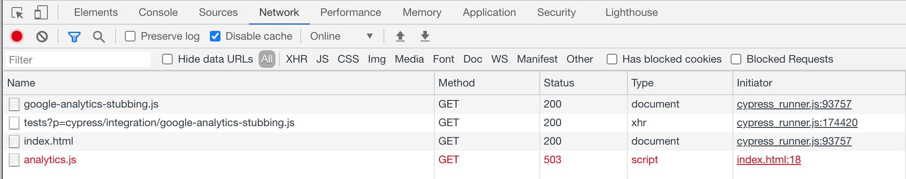
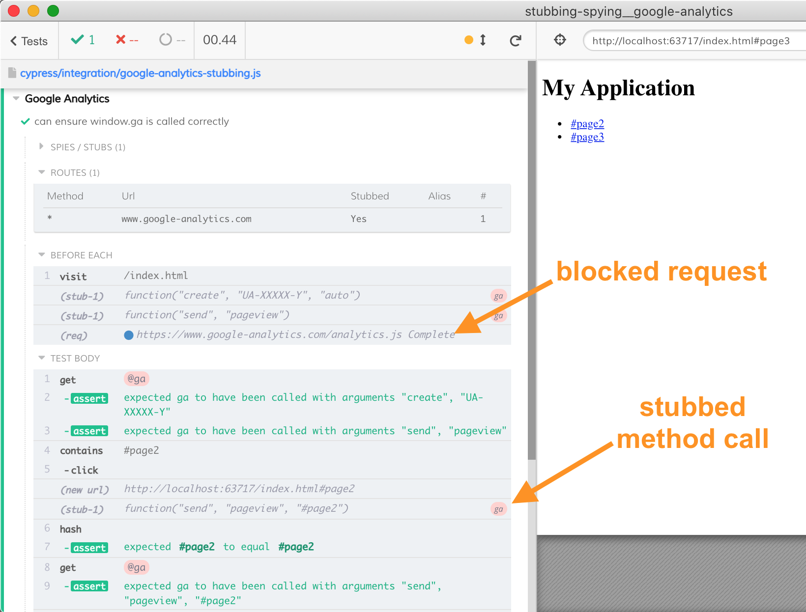
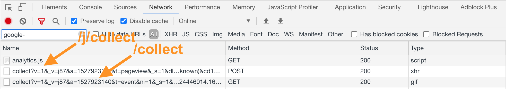
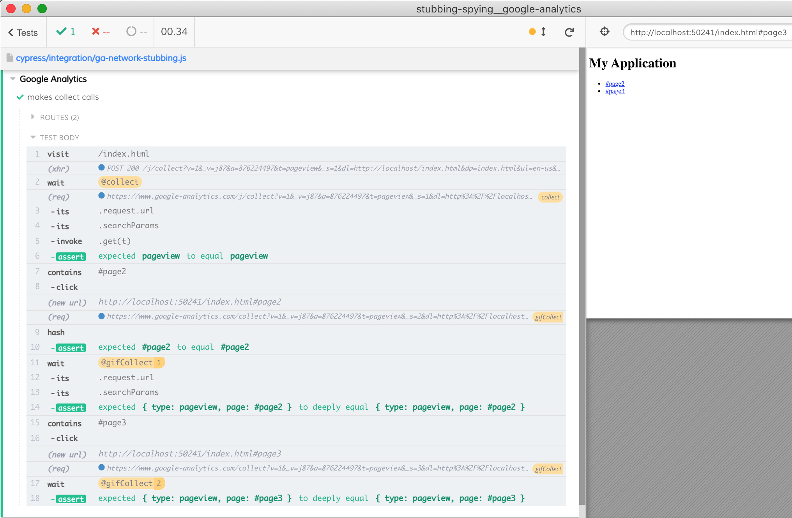

# Stubbing Google Analytics

This recipe shows how to test the Google Analytics logic in two ways
- by stubbing method calls to `window.ga`
- by intercepting the actual method calls Google Analytics makes to its event collection endpoint

## How Google Analytics works

The JavaScript code in [index.html](index.html) loads the Google Analytics script from address "https://www.google-analytics.com/analytics.js". This script creates a method `window.ga` that the application then can use to send analytics events to the server. The first call creates a new analytics client, and the calls after that send particular events.

```js
// in index.html
ga('create', 'UA-XXXXX-Y', 'auto');
ga('set', 'page', 'index.html');
ga('send', 'pageview');
```

Every call to `set page` executed an Ajax call to `www.google-analytics.com/j/collect`, while every `pageview` call simply requests a tiny GIF image from `www.google-analytics.com/collect` which is a very lightweight request.

Our application is a Single-Page-App, thus following the [GA practices](https://developers.google.com/analytics/devguides/collection/analyticsjs/single-page-applications) our application sends a `pageview` event on every hash change

```js
// in index.html
window.onhashchange = function () {
  // an example of calling into GA whenever there is a
  // hashchange. this is used for demonstration purposes
  ga('send', 'pageview', window.location.hash)
}
```

Using our Cypress tests we can confirm the application is making the right calls to the `window.ga` function. We can go even further and confirm the expected network calls are made to the `www.google-analytics.com` servers.

## Stubbing `window.ga` method

The first example in [ga-method-stubbing.js](cypress/integration/ga-method-stubbing.js) blocks all requests to domain `www.google-analytics.com`. Even though we are preventing the actual `GA` script from loading, we can still stub the `window.ga` object and ensure its being called correctly.

- Use [`cy.intercept`](https://on.cypress.io/intercept) to block Google Analytics from receiving requests.
- Use [`cy.stub()`](https://on.cypress.io/stub) to verify that `window.ga(...)` was called with the correct arguments

The next screenshot shows how the script is being blocked with a `503` server response code.



You can see the intercepted network call and the `window.ga` stub calls in the Command Log



See [cy.stub](https://on.cypress.io/stub) for more details

## Alternative: stubbing network calls

We can do more than just stub `window.ga` calls. We can confirm that the actual network calls happen. If you inspect the network tab when GA works, you will see both `POST` XHR calls and `GET` image calls.



**Note:** the XHR call goes to `https://www.google-analytics.com/j/collect` endpoint, while the image resource is loaded from `https://www.google-analytics.com/collect`

The spec file [ga-network-stubbing.js](cypress/integration/ga-network-stubbing.js) shows how to stub both

```js
cy.intercept('POST', 'https://www.google-analytics.com/j/collect',
  { statusCode: 200 }).as('collect')
cy.intercept('GET', 'https://www.google-analytics.com/collect',
  { statusCode: 200 }).as('gifCollect')
cy.visit('/index.html')
```

Then we can wait for these network calls and confirm the URL search parameters. I am using `URL` browser API to do the parsing, which requires several steps. Luckily, these calls can be extracted into a common utility method. In our test thus we can confirm the page view events like this:

```js
cy.contains('#page3').click()
// let's confirm the event and the "page=#page3"
cy.wait('@gifCollect').then(interceptToPageEvent).should('deep.equal', {
  type: 'pageview',
  page: '#page3',
})
```



For particular calls we can match using the query arguments. For example, the button click sends an event that we can intercept with

```js
cy.intercept({
  pathname: '/collect',
  query: {
    ec: 'button',
    ea: 'click',
    el: 'Register'
  }
}, {
  statusCode: 200
}).as('register')
```

After the above specific stub we can register all other generic network intercepts.

See [cy.intercept](https://on.cypress.io/intercept) for more details
