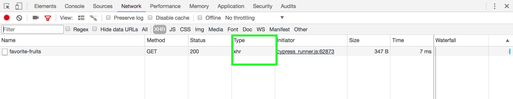
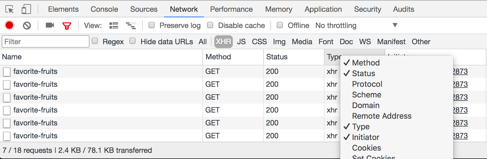

# Stubbing `window.fetch`

- Use [`cy.spy()`](https://on.cypress.io/spy) to verify the behavior of a function.
- Use [`cy.stub()`](https://on.cypress.io/stub) to verify and control the behavior of a function.
- Use [`cy.clock()`](https://on.cypress.io/clock) and [`cy.tick()`](https://on.cypress.io/tick) to control time.
- Stub `window.fetch` to control server responses.
- Replace `window.fetch` with a polyfill that uses XHR and is loaded only for tests, see [polyfill-fetch-from-tests-spec.js](cypress/integration/polyfill-fetch-from-tests-spec.js)

See individual spec files in [cypress/integration](cypress/integration) folder.

## Deleting `fetch`

Until issue [#95](https://github.com/cypress-io/cypress/issues/95) is implemented, if your application uses `fetch` protocol to make Ajax requests, Cypress cannot see or stub these network calls. To quickly check what requests the web application is making, open DevTools Network tab and check the "type" column. If the type shows `xhr`, Cypress can see it. If the type says `fetch`, Cypress cannot intercept it yet.



**Tip:** if the "type" column is not there, add it by right-clicking on any column and checking "Type" entry.



### Delete in `cy.visit`

You can delete `window.fetch` when calling `cy.visit`, which in most libraries drops back to using XHR

```javascript
cy.visit('/', {
  onBeforeLoad (win) {
    delete win.fetch
  },
})
```

### Delete on every window load

You can register a callback to execute on each `window:load`

```javascript
Cypress.on('window:before:load', (win) => {
  delete win.fetch
})
```
