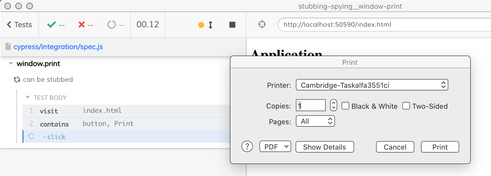
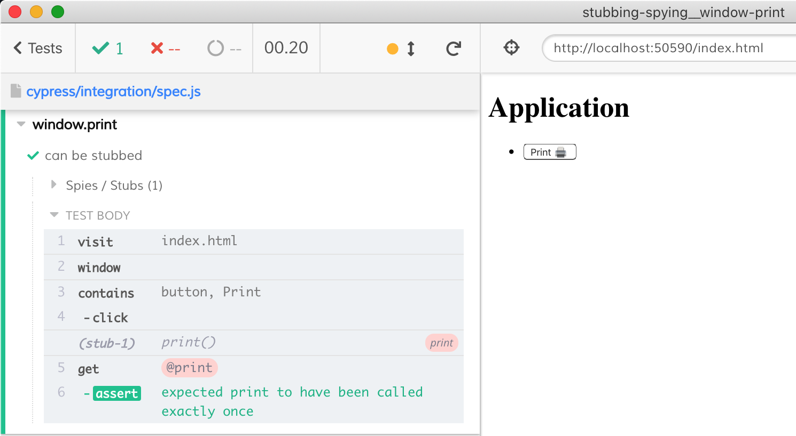

# Stubbing `window.print`

This is an example showing how to stub `window.print` method call

## The application

The page [index.html](index.html) calls `window.print` on button click. Without stubbing, the test would click and then a system print dialog would block the rest of the test.

By stubbing the `window.print` the [spec.js](cypress/integration/spec.js) can confirm the call has happened.

