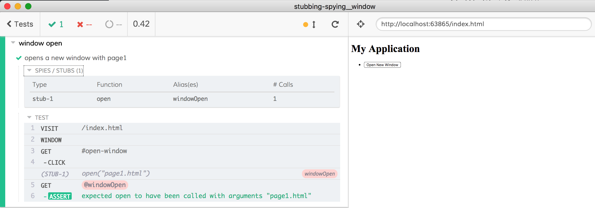
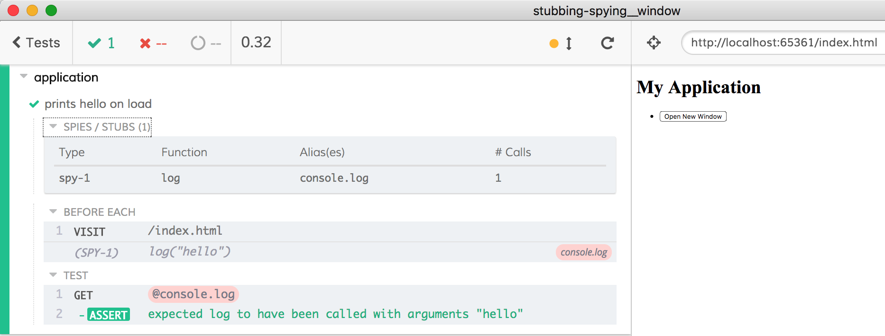

# Stubbing Window

This is an example showing how to stub `window` and `console` calls.

## The application

The application [index.html](index.html) has a single button that executes `window.open` on click. The application also prints "hello" to the console as soon as it loads.

## The tests

- [cypress/integration/spec.js](cypress/integration/spec.js) stubs the `window.open` method using [`cy.stub()`](https://on.cypress.io/stub). Because the application executes `window.open` after the click we create the method stub after [`cy.visit`](https://on.cypress.io/visit)

- [cypress/integration/spy-before-load.js](cypress/integration/spy-before-load.js) starts spying on `console.log` during [`cy.visit`](https://on.cypress.io/visit) to confirm that `console.log('hello')` is called when the page loads.

