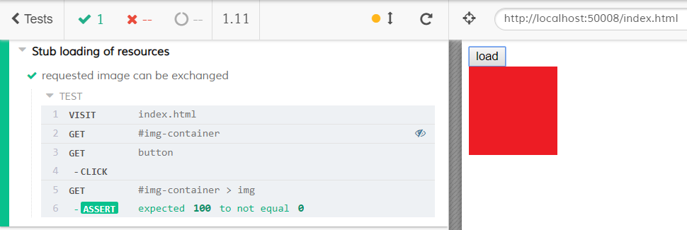

# Stubbing Resources

The spec file [cypress/integration/spec.js](cypress/integration/spec.js) shows how to stub resources that are loaded e.g. by `img` tag. This works by observing DOM mutations and changing the `src` attribute.

When clicking onto the button in the `index.html`, a new `img` tag is created that is supposed to load [images/rose.png](images/rose.png). Instead we load a red image from the fixture file [cypress/fixtures/picture.png](cypress/fixtures/picture.png).

