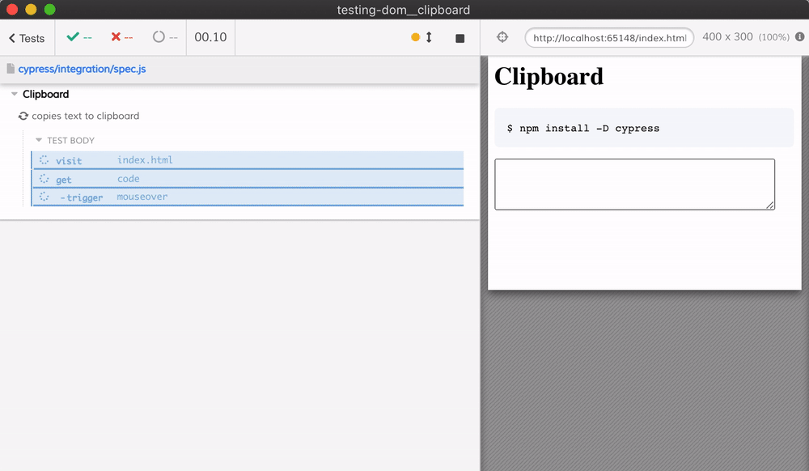

# Clipboard
> Copy / paste text example

The widget to copy text is `@github/clipboard-copy-element` custom element that comes from [github/github-elements](https://github.com/github/github-elements)

See the [cypress/integration/spec.js](./cypress/integration/spec.js) file. The test currently work only in Electron where the clipboard permission is granted when Cypress starts it.

The page [index.html](./index.html) shows the copy button on "mouseover" event. When the text is copied to the clipboard, it shows a [tiny toast](https://github.com/bahmutov/tiny-toast) popup.

See the [Mozilla Clipboard docs](https://developer.mozilla.org/en-US/docs/Mozilla/Add-ons/WebExtensions/Interact_with_the_clipboard)

## Other browsers

Work in progress, mostly because the default permissions prompt the user to allow the page to access the clipboard.

## Videos

We show how to test the clipboard access from Cypress in these videos:

- [Access the clipboard from Cypress test using Electron browser](https://youtu.be/SExmed1dCL4)
