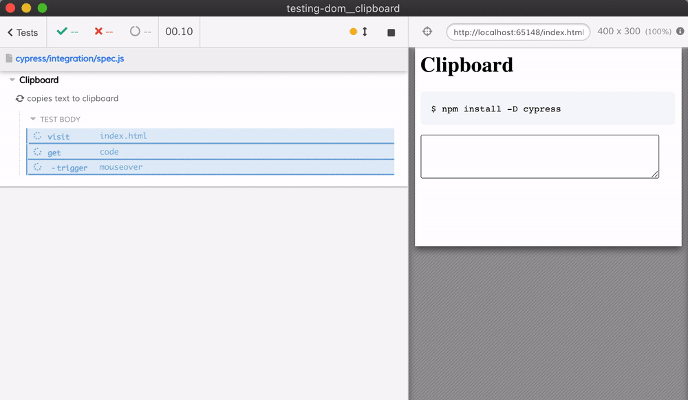

# Clipboard
> Copy / paste text example

The widget to copy text is the `@github/clipboard-copy-element` custom element that comes from [github/github-elements](https://github.com/github/github-elements). It and the [tiny toast](https://github.com/bahmutov/tiny-toast) popup shown on copy are vendored at pinned versions under [vendor](./vendor), so the page has no runtime CDN dependency.



The page [index.html](./index.html) shows the copy button on "mouseover". Copying goes through `navigator.clipboard.writeText`, and the tests read the text back with `navigator.clipboard.readText`.

- [cypress/e2e/spec.cy.js](./cypress/e2e/spec.cy.js) copies the code snippet and pastes it into the page two different ways.
- [cypress/e2e/permissions-spec.cy.js](./cypress/e2e/permissions-spec.cy.js) queries the clipboard permission state.

See the [Mozilla Clipboard API docs](https://developer.mozilla.org/en-US/docs/Web/API/Clipboard_API).

## Browser support

Both specs run in Chrome only, set through the `browser` test configuration option, and the recipe's npm scripts and CI job pass `--browser chrome`. Firefox and WebKit do not expose `navigator.clipboard.readText()` to the page.

Chrome starts with the clipboard permission in the `prompt` state, which would open a popup the test cannot answer, so the tests grant it for the current origin over the Chrome DevTools Protocol:

```js
cy.wrap(Cypress.automation('remote:debugger:protocol', {
  command: 'Browser.grantPermissions',
  params: {
    permissions: ['clipboardReadWrite', 'clipboardSanitizedWrite'],
    origin: window.location.origin,
  },
}))
```

## Pasting

Cypress sends key events, it does not perform a native paste, so `cy.type('{ctrl}v')` pastes only if your application handles the shortcut itself — which is what grid and editor components tend to do. The recipe covers both shapes an application can take:

- an application that listens for the `paste` event receives a `ClipboardEvent` built in the application's window and carrying a `DataTransfer`
- an application that implements Ctrl+V itself reads `navigator.clipboard` when the test types the shortcut
