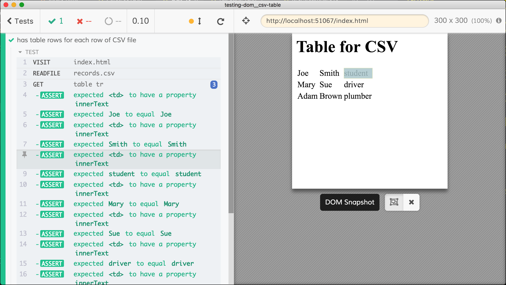
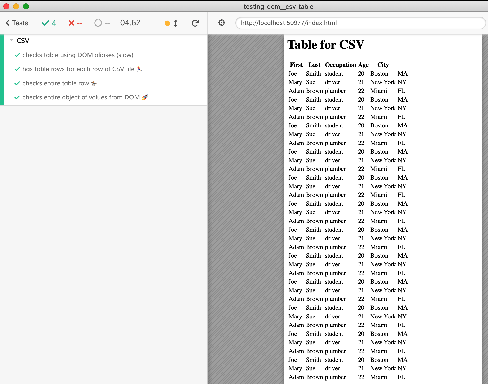
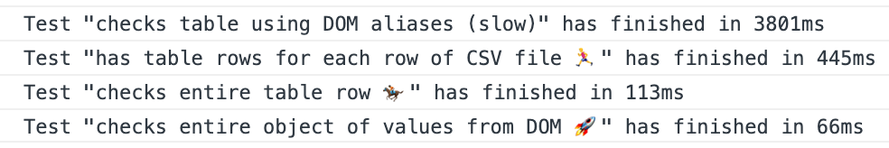

# CSV and table recipe

> Loads CSV file and checks HTML table to have the text content matching the loaded CSV records

Uses [neat-csv](https://github.com/sindresorhus/neat-csv) to parse the loaded CSV text into records.

## Tests

- [spec.js](cypress/integration/spec.js) loads the CSV file using [`cy.readFile`](https://on.cypress.io/readfile), parses the text into list of objects, then goes through the rows of the table element comparing cell text content to the records.



## Speed

The spec file has 4 tests. The slowest wraps _every_ access to the table's row and cell in a [Cypress alias variable](https://on.cypress.io/variables-and-aliases). While convenient, unless the cell's values are changing and need to [retry assertions](https://on.cypress.io/retry-ability), it introduces performance overhead.

The spec includes a few additional tests that avoid aliases and run much faster:

- access every row then use the DOM to access and check each child cell
- access every row, extract `innerText` from every cell and compare the entire list at once
- access the entire table, extract `innerText` from every cell and compare the entire list of values at once



We can get the test duration by subscribing to the [`test:after:run`](https://on.cypress.io/catalog-of-events#Cypress-Events) event.

```js
Cypress.on('test:after:run', (attributes) => {
  console.log('Test "%s" has finished in %dms', attributes.title, attributes.duration)
})
```


