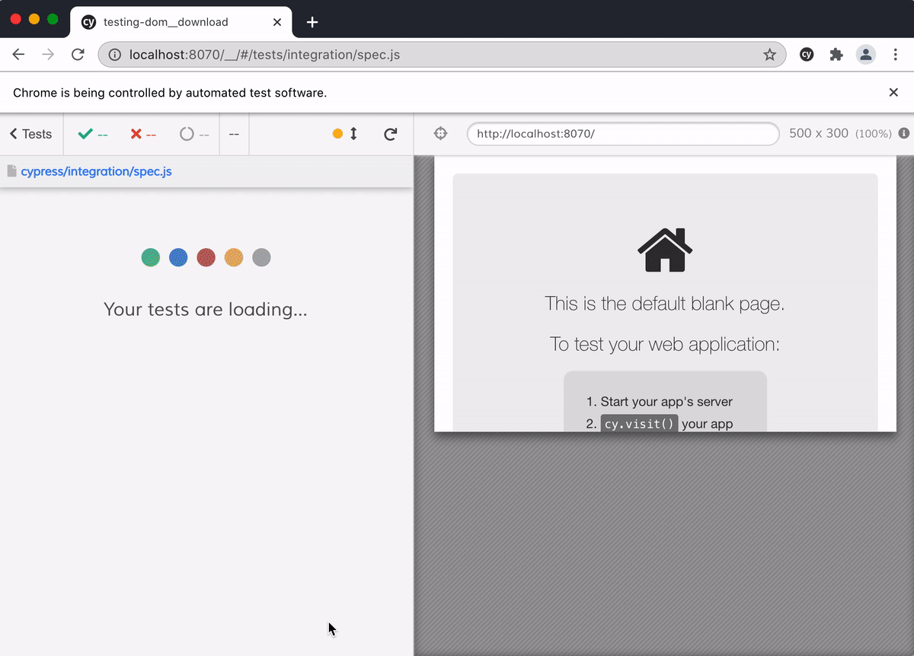
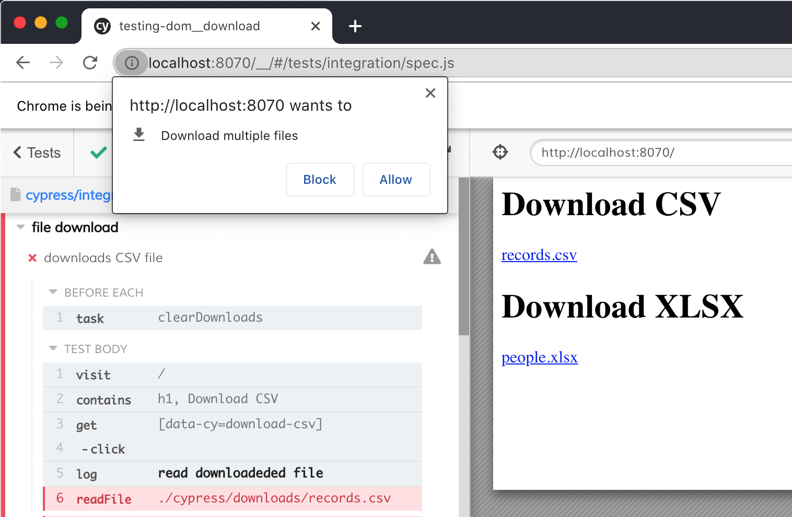

# Download and validate a file

See [cypress/plugins/index.js](cypress/plugins/index.js) to see how we set the download folder when launching the browser. The [cypress/integration/csv-spec.js](cypress/integration/csv-spec.js) clicks the link to downloads the file and validates it.

**Important** trying to download several files in a single test or from several tests in the same spec file will cause the browser to show a popup blocking the rest of the downloads.

You can avoid it by only running a single spec at a time (avoid using "Run all specs" button)
