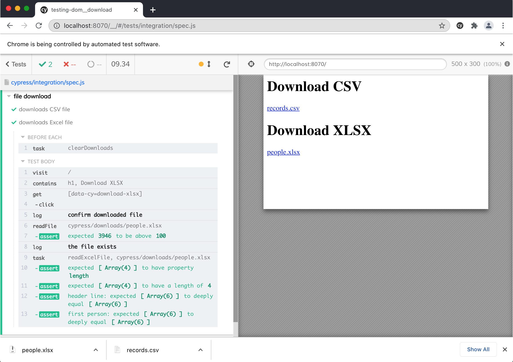

# Download and validate a file

- a CSV file
- an Excel file
- a PNG image
- a TXT file
- a JS file
- a Zip file
- a PDF file

Spec file | Description
---|---
[form-submission-spec.cy.js](./cypress/e2e/form-submission-spec.cy.js) | Intercepts and verifies a file downloaded after a form submission
[local-download-spec.cy.js](./cypress/e2e/local-download-spec.cy.js) | Downloads files from local domain by using `<a href=... download>` anchor links
[location-href-spec.cy.js](./cypress/e2e/location-href-spec.cy.js) | Intercepts and verifies a file downloaded via setting `document.location.href=...` URL
[remote-download-spec.cy.js](./cypress/e2e/remote-download-spec.cy.js) | Downloads files from another domain by using `<a href=... download>` anchor links

## Notes

Text files are validated right from the browser spec, but the binary files like the downloaded Zip archives need to be validated from Node code, see [setupNodeEvents](cypress.config.js)

The spec also shows how to "catch" form submission that downloads a file using [cy.intercept()](https://on.cypress.io/intercept). After intercepting the request and redirecting back at the test, the test shows how to request the file and validate it.

The spec shows how to call a task to find the downloaded file using a wildcard mask. This is useful if you do not know the exact filename beforehand.
