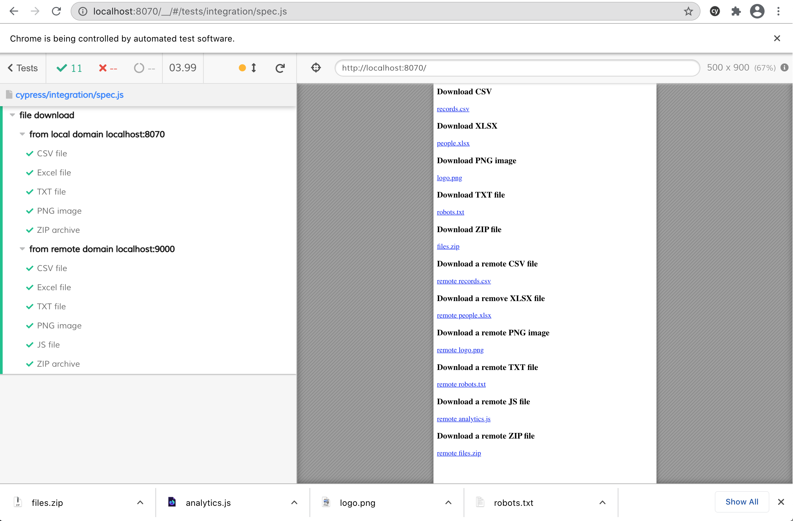

# Download and validate a file

See [cypress/plugins/index.js](cypress/plugins/index.js) to see how we set the download folder when launching the browser. See the [cypress/integration/spec.js](cypress/integration/spec.js) spec file that downloads and verifies:
- a CSV file
- an Excel file
- a PNG image
- a TXT file
- a JS file

