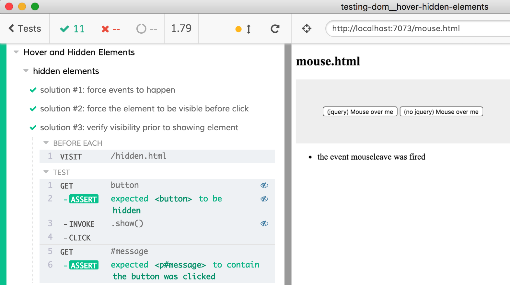

# hover-hidden-elements
> Interact with elements that are hidden by CSS

See [cypress/integration/hover-hidden-elements-spec.js](cypress/integration/hover-hidden-elements-spec.js) to find how to get around Cypress' lack of `.hover()` command.

- Interact with elements that are hidden by CSS.
- Use [`.invoke()`](https://on.cypress.io/invoke) and [`.trigger()`](https://on.cypress.io/trigger) to simulate hovering.
- Trigger `mouseover`, `mouseout`, `mouseenter`, `mouseleave` events.
- Get around the lack of a `.hover()` command.

