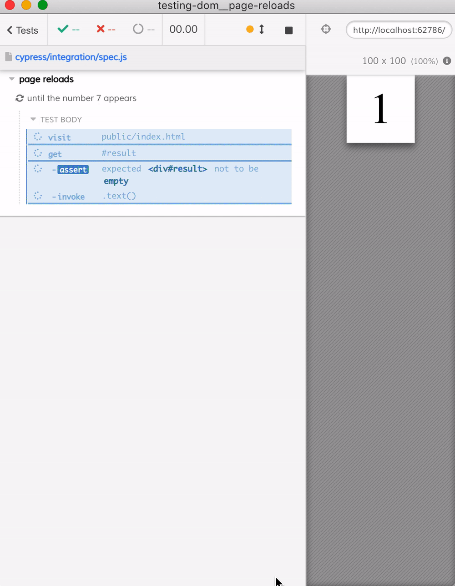

# Page reloads
> The test reloads the page until an expected text appears

Cypress commands are first queued and then executed asynchronously. Thus trying to use `while` loop in your test will for sure NOT work as you would expect it. A better strategy to write a test with unknown number of steps is to use an intermediate function that you can call to iterate again.

For example, this recipe shows how to reload the page until the target element randomly draws 7.



See [cypress/integration/spec.js](cypress/integration/spec.js) file, in general it does the following:

```js
it('until the number 7 appears', () => {
  // our utility function
  const checkAndReload = () => {
    // get the element's text, convert into a number
    cy.get('#result').should('not.be.empty')
    .invoke('text').then(parseInt)
    .then((number) => {
      // if the expected number is found
      // stop adding any more commands
      if (number === 7) {
        cy.log('lucky **7**')
      } else {
        // otherwise insert more Cypress commands
        // by calling the function after reload
        cy.wait(500, { log: false })
        cy.reload()
        checkAndReload()
      }
    })
  }

  // start the test by visiting the page
  cy.visit('public/index.html')
  // and kicking off the first check
  checkAndReload()
})
```

The spec also uses [cypress-recurse](https://github.com/bahmutov/cypress-recurse) to achieve the same result.
